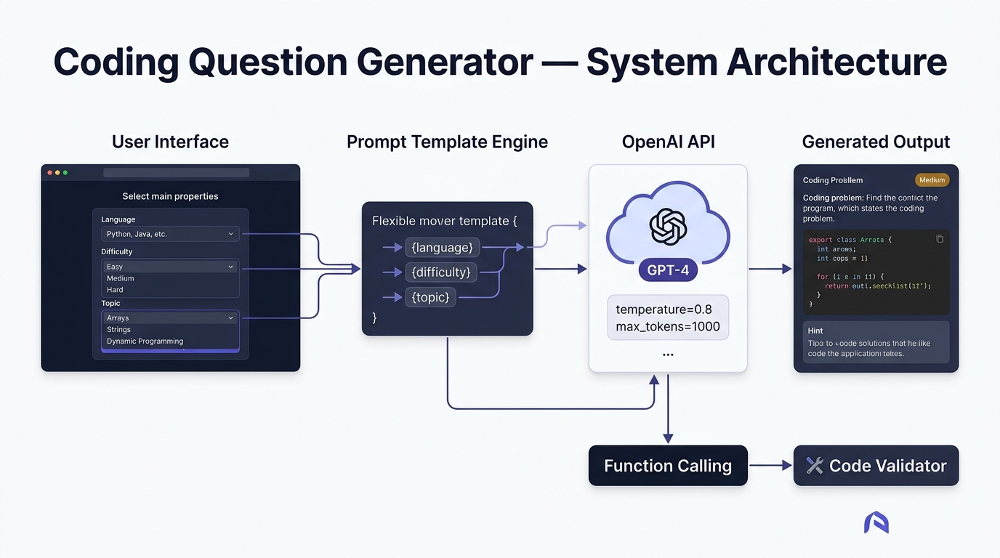
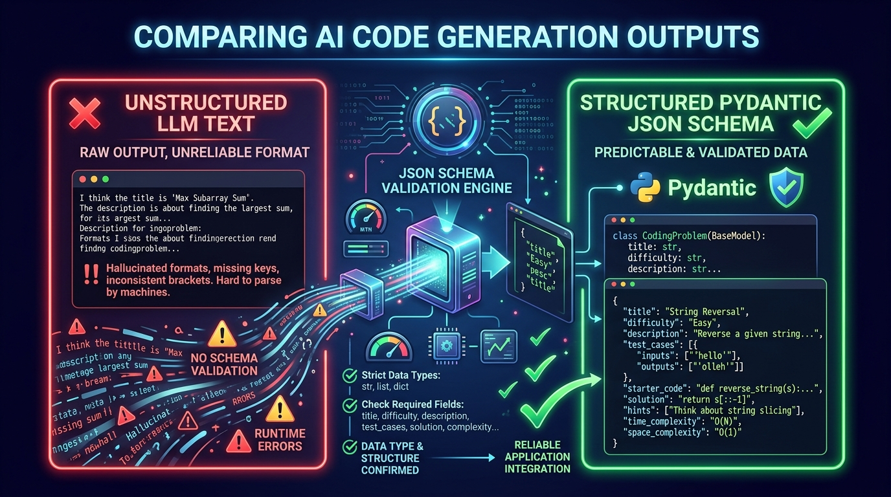

# 💻 Day 04 — Capstone Project: AI Coding Question & Assessment Generator

> **Zero to Hero Gen AI Course — Phase 01: GenAI Foundations**
>
> 📅 Day 4 of 50 | ⏱️ Estimated Reading Time: 60 minutes
>
> **Project Goal:** Build a production-grade, end-to-end AI system that automatically synthesizes LeetCode/HackerRank-style coding interview questions, enforces strict Pydantic schemas, safely compiles and executes candidate code in an AST-sandboxed test harness, and generates Big-O complexity reviews with progressive hints.

---

## 📑 Table of Contents

1. [Project Overview & Real-World Motivation](#1-project-overview--real-world-motivation)
2. [High-Level System Architecture](#2-high-level-system-architecture)
3. [The Core Question Generation Pipeline](#3-the-core-question-generation-pipeline)
4. [Prompt Engineering & Few-Shot Design](#4-prompt-engineering--few-shot-design)
5. [Structured Outputs & Pydantic Schema Enforcement](#5-structured-outputs--pydantic-schema-enforcement)
6. [Algorithmic Test Suite Architecture (Public vs Hidden Edge Cases)](#6-algorithmic-test-suite-architecture-public-vs-hidden-edge-cases)
7. [Sandboxed Code Execution & Security Guardrails](#7-sandboxed-code-execution--security-guardrails)
8. [Automated AI Code Reviewer & Complexity Analyzer](#8-automated-ai-code-reviewer--complexity-analyzer)
9. [Multi-Model Provider Architecture](#9-multi-model-provider-architecture)
10. [Complete Codebase Deep Dive](#10-complete-codebase-deep-dive)
    - [10.1 Data Models (`models.py`)](#101-data-models-modelspy)
    - [10.2 Prompt Engineering Templates (`prompts.py`)](#102-prompt-engineering-templates-promptspy)
    - [10.3 Generation Engine (`generator.py`)](#103-generation-engine-generatorpy)
    - [10.4 Sandboxed Evaluator (`evaluator.py`)](#104-sandboxed-evaluator-evaluatorpy)
    - [10.5 AI Code Reviewer & Hints (`reviewer.py`)](#105-ai-code-reviewer--hints-reviewerpy)
    - [10.6 Exporter Utilities (`exporter.py`)](#106-exporter-utilities-exporterpy)
    - [10.7 Interactive CLI (`cli.py`)](#107-interactive-cli-clipy)
    - [10.8 Modern Streamlit Web Application (`app.py`)](#108-modern-streamlit-web-application-apppy)
11. [How to Run and Test the Project](#11-how-to-run-and-test-the-project)
12. [Security, Performance & Production Best Practices](#12-security-performance--production-best-practices)
13. [Key Takeaways & Conceptual Review](#13-key-takeaways--conceptual-review)
14. [Curated Video Walkthroughs & Visual Animations](#14-curated-video-walkthroughs--visual-animations)
15. [Hands-On Practice Challenges](#15-hands-on-practice-challenges)

---

## 1. Project Overview & Real-World Motivation

Technical hiring at modern technology companies (Google, Meta, Amazon, Microsoft, high-growth startups, and quantitative hedge funds) relies heavily on **algorithmic coding assessments**. Platforms such as **LeetCode**, **HackerRank**, **CodeSignal**, and **Karat** maintain vast question banks. However, traditional question banks face critical failure modes:

| Traditional Challenge | Real-World Impact | How GenAI Solves It |
|-----------------------|-------------------|---------------------|
| **Question Leaks & Cheating** | Questions get posted online to Reddit, Discord, and GitHub within hours. | **Dynamic Synthesis:** Generates unique, novel question variants on the fly for every candidate. |
| **High Question Authoring Costs** | Authoring one high-caliber problem with verified test cases takes senior engineers 6–10 hours ($800–$1,500 cost). | **Instant Authoring:** AI generates complete problem statements, starter code, test suites, and Big-O analyses in seconds. |
| **Rigid Difficulty Spikes** | Fixed questions often miscalibrate candidate seniority (too hard or too trivial). | **Parametric Tuning:** Calibrate difficulty (Easy/Medium/Hard/Expert) and domain (Two Pointers, Graphs, DP) dynamically. |
| **No Personalized Feedback** | Candidates receive generic "Test Case 3 Failed" with zero pedagogical feedback. | **AI Code Review:** Evaluates candidate code structure, predicts time/space complexity, and dispenses progressive hints. |

### The Engineering Challenge

Creating an AI Coding Question Generator is **not** as simple as asking ChatGPT to *"write a coding question"*. A production-grade assessment engine requires:
1. **Zero Hallucination in Test Cases:** The inputs, expected outputs, and constraints must be mathematically consistent.
2. **Strict Schema Conformance:** Downstream automated graders require exact JSON structures.
3. **Safe Sandboxed Execution:** User-submitted code might contain infinite loops (`while True:`) or malicious system commands (`os.system("rm -rf /")`).
4. **AST Security Analysis:** Static code inspection before compilation to reject unsafe operations.
5. **Accurate Complexity Benchmarking:** Distinguishing between an optimal $O(N)$ hash-table solution and a naive $O(N^2)$ brute-force loop.

---

## 2. High-Level System Architecture

The project is structured as a decoupled, multi-tier pipeline separating **Question Synthesis**, **Schema Validation**, **Execution Sandboxing**, and **Intelligent Feedback**:



> ### 🎥 Visual Explainer & Animation
> [](https://www.youtube.com/watch?v=KLlXCFG5TnA)
>
> 🎬 **[NeetCode — How LeetCode Judges & Compiles Code](https://www.youtube.com/watch?v=KLlXCFG5TnA)** (⏱️ 10 mins)  
> 💡 *Visual Highlights:* Behind-the-scenes architectural breakdown of how online judges compile candidate submissions, run public vs hidden test cases, enforce memory/time quotas, and grade solutions.

### Core Components

```
┌─────────────────────────────────────────────────────────────────────────────┐
│                            1. INPUT PARAMETERS                              │
│         Topic (e.g., Arrays) | Difficulty (Medium) | Company Track (FAANG)  │
└──────────────────────────────────────┬──────────────────────────────────────┘
                                       │
                                       ▼
┌─────────────────────────────────────────────────────────────────────────────┐
│                      2. PROMPT ORCHESTRATION ENGINE                         │
│       System Prompt + Few-Shot Examples + Strict Pydantic JSON Directives    │
└──────────────────────────────────────┬──────────────────────────────────────┘
                                       │
                                       ▼
┌─────────────────────────────────────────────────────────────────────────────┐
│                       3. MULTI-MODEL LLM INFERENCE                          │
│         OpenAI (GPT-4o) | Google Gemini (1.5 Flash) | Offline Mock Engine   │
└──────────────────────────────────────┬──────────────────────────────────────┘
                                       │
                                       ▼
┌─────────────────────────────────────────────────────────────────────────────┐
│                    4. PYDANTIC JSON SCHEMA VALIDATION                       │
│    Strict type checks on inputs, expected outputs, constraints, starter code │
└──────────────────────────────────────┬──────────────────────────────────────┘
                                       │
                                       ▼
┌─────────────────────────────────────────────────────────────────────────────┐
│                  5. SANDBOXED EXECUTION & TEST HARNESS                      │
│     AST Security Guard ──► Thread Timeout (2.0s) ──► Deep Equality Grader   │
└──────────────────────────────────────┬──────────────────────────────────────┘
                                       │
                                       ▼
┌─────────────────────────────────────────────────────────────────────────────┐
│                       6. AI CODE REVIEW & FEEDBACK                          │
│     Big-O Complexity Review | Progressive 3-Tier Hints | Markdown Export    │
└─────────────────────────────────────────────────────────────────────────────┘
```

---

## 3. The Core Question Generation Pipeline

The generation pipeline translates high-level candidate specifications into fully validated problem definitions:


### Step-by-Step Flow

1. **User Specification:** The client (CLI or Web UI) specifies parameters:
   - **Topic:** Arrays, Two Pointers, Dynamic Programming, Trees, Graphs, etc.
   - **Difficulty:** Easy, Medium, Hard, Expert.
   - **Language:** Python, JavaScript, Java, C++, Go.
   - **Company Style:** FAANG / Big Tech, High-Growth Startup, FinTech / Quant.
2. **Context Enrichment:** The prompt orchestrator loads calibrated few-shot examples demonstrating ideal problem formatting, constraint bounds, and boundary test cases.
3. **Structured Inference:** The LLM receives the enriched prompt with strict JSON schema instructions.
4. **Parsing & Defensive Fallbacks:** If the LLM wraps output in markdown fences (````json ... ````), regex extractors cleanly isolate the raw JSON payload and validate it against the Pydantic data model.
5. **Solution Self-Check:** The generator optionally runs the generated optimal solution against its own generated test cases to verify internal consistency before presenting the problem to the candidate.

---

## 4. Prompt Engineering & Few-Shot Design

Why is few-shot prompting essential for coding question generation?

Without few-shot demonstrations, LLMs commonly commit four critical mistakes:
1. **Vague Constraints:** Writing *"nums has some numbers"* instead of `1 <= nums.length <= 10^5`.
2. **Mismatched Signatures:** The function signature in the starter code does not match the parameters used in the test case dictionary.
3. **Missing Boundary Cases:** Providing only trivial examples (e.g., `[1, 2, 3]`) while omitting negatives, zeroes, or single-element inputs.
4. **Conversational Drift:** Prefixing the response with *"Sure! Here is a great problem for your interview..."*, breaking automated JSON parsers.

### The System Prompt

```python
SYSTEM_QUESTION_ARCHITECT = """You are a Principal Software Engineer and Staff Interview Architect at a top tier technology firm (FAANG/MAANG).
Your mission is to generate novel, mathematically sound, highly engaging coding interview questions that rigorously test candidates on:
1. Algorithmic thinking and time/space complexity optimization.
2. Handling tricky edge cases (empty inputs, single elements, integer overflow, negatives, duplicates).
3. Writing clean, idiomatic, and maintainable code.

CRITICAL QUALITY DIRECTIVES:
- NO DUPLICATE CLONES: Do not simply copy LeetCode #1 Two Sum word-for-word. Frame novel scenarios, engaging story backdrops, or creative algorithmic twists.
- STRICT TYPE SAFETY: Starter code and optimal solutions must include proper typing, clean docstrings, and descriptive variable names.
- EXHAUSTIVE TEST SUITE: Generate at least 5 test cases:
  * 2 Public Example test cases with clear step-by-step explanations.
  * 3 Hidden test cases specifically targeting boundary conditions.
- DETERMINISTIC OUTPUT: You must output ONLY a valid JSON object strictly conforming to the requested schema. No conversational filler.
"""
```

---

## 5. Structured Outputs & Pydantic Schema Enforcement

LLMs are probabilistic token predictors. To build robust software upon them, we must convert non-deterministic natural language into **deterministic, type-safe data structures**:



> ### 🎥 Visual Explainer & Animation
> [](https://www.youtube.com/watch?v=Vj-iJb_80rw)
>
> 🎬 **[freeCodeCamp — Pydantic V2 Python Crash Course](https://www.youtube.com/watch?v=Vj-iJb_80rw)** (⏱️ 35 mins)  
> 💡 *Visual Highlights:* Step-by-step visual demonstration of defining Pydantic models, automatic type coercion, schema validation, and enforcing deterministic JSON structures from LLM responses.

### The Pydantic Data Model Hierarchy

```python
from pydantic import BaseModel, Field
from typing import List, Dict, Any, Optional

class TestCase(BaseModel):
    inputs: Dict[str, Any]
    expected_output: Any
    is_hidden: bool = False
    explanation: Optional[str] = None

class ComplexityAnalysis(BaseModel):
    time_complexity: str
    space_complexity: str
    explanation: str

class CodingProblem(BaseModel):
    id: str
    title: str
    difficulty: DifficultyLevel
    topic: ProblemTopic
    language: ProgrammingLanguage
    description: str
    constraints: List[str]
    function_name: str
    starter_code: str
    test_cases: List[TestCase]
    optimal_solution: str
    brute_force_solution: Optional[str] = None
    complexity: ComplexityAnalysis
    hints: List[str]
    tags: List[str]
```

### Why Pydantic Validation Matters

1. **Automatic Type Coercion & Validation:** Ensures `test_cases` is a list of objects containing `inputs` and `expected_output`.
2. **Serialization & Export:** Provides built-in `.model_dump_json()` and `.model_dump()` methods for saving to databases, files, or transmitting over REST APIs.
3. **IDE Autocomplete:** Developers working with the codebase get full IntelliSense and type checking across all downstream modules.

---

## 6. Algorithmic Test Suite Architecture (Public vs Hidden Edge Cases)

A robust coding problem requires two distinct tiers of test cases:

```
┌────────────────────────────────────────────────────────────────────────┐
│                        PROBLEM TEST SUITE                              │
├───────────────────────────────────┬────────────────────────────────────┤
│       PUBLIC TEST CASES           │        HIDDEN TEST CASES           │
│     (Displayed in Problem)        │      (Kept Secret from User)       │
├───────────────────────────────────┼────────────────────────────────────┤
│ • Example 1: Standard input       │ • Edge Case 1: Minimum bounds      │
│ • Example 2: Nominal case         │ • Edge Case 2: Maximum scale (10^5)│
│ • Clear explanation included      │ • Edge Case 3: Negatives / Zeroes  │
│ • Helps candidate understand task │ • Edge Case 4: Duplicates / All Eq │
│ • Prevents syntax confusion       │ • Prevents hardcoding `if x==...`  │
└───────────────────────────────────┴────────────────────────────────────┘
```

### Deep Equality Grader

Testing algorithms requires nuanced comparison beyond Python's basic `==`:
- **Floating Point Numbers:** Numbers like `0.1 + 0.2 = 0.30000000000000004` will fail a naive `== 0.3` check. We use `math.isclose(a, b, rel_tol=1e-5)`.
- **Nested Collections:** Comparing nested lists, dictionaries, and tuples recursively.
- **Order-Agnostic Sets:** When problems permit answers in any order, the grader can compare sorted representations.

---

## 7. Sandboxed Code Execution & Security Guardrails

Running unvetted code submitted by users poses severe security and stability risks:


> ### 🎥 Visual Explainer & Animation
> [](https://www.youtube.com/watch?v=5UfUPJc87aE)
>
> 🎬 **[ArjanCodes — Testing Untrusted Code Safely (Code Sandbox Architecture)](https://www.youtube.com/watch?v=5UfUPJc87aE)** (⏱️ 18 mins)  
> 💡 *Visual Highlights:* Essential architectural patterns for building secure code evaluation sandboxes in Python: preventing system exploitation, thread timeouts, and handling arbitrary code safely.

### The Three Threat Vectors & Solutions

#### Threat 1: Malicious System Access
A malicious user might submit:
```python
import os
os.system("cat /etc/passwd")  # Steal server credentials
```
**Solution: Static AST Inspection.**

> ### 🎥 Visual Explainer & Animation
> [](https://www.youtube.com/watch?v=7tCNu4CnjVc)
>
> 🎬 **[Computerphile — Abstract Syntax Trees (AST) Explained](https://www.youtube.com/watch?v=7tCNu4CnjVc)** (⏱️ 14 mins)  
> 💡 *Visual Highlights:* Animated breakdown showing how code strings are transformed into hierarchical syntax trees and traversed to inspect statements, imports, and detect forbidden system calls.
Before executing the code, we parse it into an Abstract Syntax Tree (`ast.parse`) and traverse every node. If any disallowed module (`os`, `sys`, `subprocess`, `socket`, `shutil`) or dangerous builtin (`eval`, `exec`, `open`, `__import__`) is detected, execution is immediately halted with a `SecurityViolationError`:

```python
PROHIBITED_MODULES = {"os", "sys", "subprocess", "socket", "builtins", "shutil"}
PROHIBITED_FUNCTIONS = {"eval", "exec", "__import__", "compile", "open"}

def verify_ast_security(code_str: str) -> None:
    tree = ast.parse(code_str)
    for node in ast.walk(tree):
        if isinstance(node, ast.Import):
            for alias in node.names:
                if alias.name.split(".")[0] in PROHIBITED_MODULES:
                    raise SecurityViolationError(f"Import '{alias.name}' is prohibited.")
        elif isinstance(node, ast.Call):
            if isinstance(node.func, ast.Name) and node.func.id in PROHIBITED_FUNCTIONS:
                raise SecurityViolationError(f"Call '{node.func.id}()' is prohibited.")
```

#### Threat 2: Infinite Loops & Hangs
A candidate writes:
```python
def solve(nums):
    while True:
        pass  # Freezes CPU worker
```
**Solution: Thread-Isolated Timeout Guards.**
Each test execution is dispatched to a worker thread via `ThreadPoolExecutor` wrapped in a strict timeout (default: 2.0 seconds). If the function does not return within 2.0 seconds, the runner terminates the wait and records a `TimeLimitExceeded` verdict.

#### Threat 3: Stdout Pollution
Candidates often leave debugging `print("debug:", x)` statements that can corrupt test runner outputs. We wrap execution in `contextlib.redirect_stdout(io.StringIO())` to capture output cleanly.

---

## 8. Automated AI Code Reviewer & Complexity Analyzer

Passing all test cases is only half the battle in technical interviews. Senior interviewers evaluate:
1. **Time Complexity:** Did the candidate write an $O(N)$ solution, or an $O(N^2)$ brute force that barely scraped past the test limits?
2. **Space Complexity:** Did they use $O(1)$ auxiliary space or allocate unnecessary $O(N)$ buffers?
3. **Progressive Hints:** If a candidate is stuck, how can we nudge them without giving away the entire solution?

### Heuristic AST Complexity Analysis vs LLM Review

> ### 🎥 Visual Explainer & Animation
> [](https://www.youtube.com/watch?v=xgh1VnNlGjU)
>
> 🎬 **[mCoding — Python AST & Code Inspection Tutorial](https://www.youtube.com/watch?v=xgh1VnNlGjU)** (⏱️ 12 mins)  
> 💡 *Visual Highlights:* Hands-on code tutorial demonstrating how `ast.walk` traverses Python syntax trees to inspect variable scopes, measure nesting complexity, and block malicious imports.

Our project employs a **dual-layer review architecture**:
1. **Deterministic AST Analyzer (Offline):**
   - Measures maximum loop nesting depth (`for` / `while` inside `for`).
     - 0 loops $\rightarrow O(1)$ Constant Time
     - 1 loop $\rightarrow O(N)$ Linear Time
     - 2 nested loops $\rightarrow O(N^2)$ Quadratic Time
   - Detects recursive function calls (potential exponential branching).
2. **LLM Qualitative Reviewer (Cloud API):**
   - Evaluates code readability, idiomatic Python patterns, and defensive programming.
   - Provides encouraging, constructive feedback formatted in clear Markdown.

---

## 9. Multi-Model Provider Architecture

To ensure this project is accessible to everyone regardless of whether they possess paid API keys, the generator supports four execution modes:

```
                          ┌───────────────────────────┐
                          │ CodingQuestionGenerator   │
                          │ provider="auto"           │
                          └─────────────┬─────────────┘
                                        │
           ┌────────────────────────────┼────────────────────────────┐
           ▼                            ▼                            ▼
┌──────────────────────┐     ┌──────────────────────┐     ┌──────────────────────┐
│     OpenAI Mode      │     │     Gemini Mode      │     │  Offline Mock Engine │
│  OPENAI_API_KEY set  │     │  GEMINI_API_KEY set  │     │   Zero API Key Req   │
│  (gpt-4o, gpt-4o-mini│     │   (gemini-1.5-flash) │     │ Calibrated Question  │
│  Structured Outputs) │     │    (JSON Schema)     │     │ Catalog + Grader     │
└──────────────────────┘     └──────────────────────┘     └──────────────────────┘
```

When set to `provider="auto"`, the system automatically detects available environment variables. If no keys are found, it falls back to the **Offline Mock Engine**, guaranteeing that the entire application, CLI, Web UI, and test suites run seamlessly out-of-the-box!

---

## 10. Complete Codebase Deep Dive

Let's examine the complete implementation of every module in the project directory (`project/`):

### 10.1 Data Models (`models.py`)

[models.py](file:///c:/Users/sriva/OneDrive/Desktop/GEN%20AI%20COURSE/Python/Phase_01_GenAI_Foundations/Day_04_Coding_Question_Generator/project/models.py) defines the Pydantic schemas:
- `DifficultyLevel`: Enum (`Easy`, `Medium`, `Hard`, `Expert`)
- `ProblemTopic`: Enum covering 16 algorithmic domains
- `TestCase`: Input arguments mapping, expected return value, hidden flag, explanation
- `CodingProblem`: Complete problem contract including constraints, starter code, solutions, and hints
- `EvaluationReport`: Aggregated scorecard with pass/fail counts and test timings

### 10.2 Prompt Engineering Templates (`prompts.py`)

[prompts.py](file:///c:/Users/sriva/OneDrive/Desktop/GEN%20AI%20COURSE/Python/Phase_01_GenAI_Foundations/Day_04_Coding_Question_Generator/project/prompts.py) contains:
- `SYSTEM_QUESTION_ARCHITECT`: Directives for novelty, mathematical rigor, and deterministic output
- `FEW_SHOT_PROBLEM_EXAMPLE`: Fully structured reference problem (*Reorganize Server Cluster Tasks*) demonstrating the exact JSON shape
- `QUESTION_GENERATION_PROMPT`: Parameterized template injecting `{topic}`, `{difficulty}`, `{language}`, and `{company_style}`
- `CODE_REVIEW_PROMPT`: Structured prompt guiding the AI code review agent

### 10.3 Generation Engine (`generator.py`)

[generator.py](file:///c:/Users/sriva/OneDrive/Desktop/GEN%20AI%20COURSE/Python/Phase_01_GenAI_Foundations/Day_04_Coding_Question_Generator/project/generator.py) implements the universal question generator:
- Dispatches requests to OpenAI, Google Gemini, or the Offline Mock Engine
- Features regex-powered JSON cleansing (`_clean_json_output`) to strip markdown wrappers
- Includes calibrated offline algorithmic problem presets (*Find Pair with Exact Target Product*, *Maximum Water Reservoir Trapping*, *Total Ways to Disburse Change*)

### 10.4 Sandboxed Evaluator (`evaluator.py`)

[evaluator.py](file:///c:/Users/sriva/OneDrive/Desktop/GEN%20AI%20COURSE/Python/Phase_01_GenAI_Foundations/Day_04_Coding_Question_Generator/project/evaluator.py) provides the execution test harness:
- `verify_ast_security`: Traverses AST nodes to intercept dangerous modules and functions
- `_deep_equals`: Handles float tolerance and nested structure comparisons
- `_execute_single_test`: Isolates stdout, executes function with kwargs unpacking, and records precise microsecond timings
- `evaluate_solution`: Runs full test suite under thread timeout protection and aggregates results

### 10.5 AI Code Reviewer & Hints (`reviewer.py`)

[reviewer.py](file:///c:/Users/sriva/OneDrive/Desktop/GEN%20AI%20COURSE/Python/Phase_01_GenAI_Foundations/Day_04_Coding_Question_Generator/project/reviewer.py) provides candidate feedback:
- AST loop nesting depth analysis for empirical Big-O time complexity estimation
- LLM review generation via OpenAI/Gemini
- Formatted markdown report generation highlighting passed/failed test cases and progressive hints

### 10.6 Exporter Utilities (`exporter.py`)

[exporter.py](file:///c:/Users/sriva/OneDrive/Desktop/GEN%20AI%20COURSE/Python/Phase_01_GenAI_Foundations/Day_04_Coding_Question_Generator/project/exporter.py) enables distribution:
- Renders GitHub-flavored Markdown problem sheets with HTML `<details>` spoiler tags for solutions
- Serializes problems to raw JSON for platform ingestion

### 10.7 Interactive CLI (`cli.py`)

[cli.py](file:///c:/Users/sriva/OneDrive/Desktop/GEN%20AI%20COURSE/Python/Phase_01_GenAI_Foundations/Day_04_Coding_Question_Generator/project/cli.py) provides a terminal interface:
- Rich console rendering with colorized badges and Markdown tables
- Interactive menu to generate questions, view starter code, run tests, reveal hints, and export

### 10.8 Modern Streamlit Web Application (`app.py`)

[app.py](file:///c:/Users/sriva/OneDrive/Desktop/GEN%20AI%20COURSE/Python/Phase_01_GenAI_Foundations/Day_04_Coding_Question_Generator/project/app.py) offers a web UI:
- Sidebar controls for topic, difficulty, and interview track
- Split-screen workspace: problem statement & constraints on the left, live code editor & test runner on the right
- Interactive test results breakdown with pass/fail badges, execution runtimes, and progressive hints accordion

---

## 11. How to Run and Test the Project

### Step 1: Install Requirements

Open your terminal or PowerShell and navigate to the project directory:

```bash
cd "Python/Phase_01_GenAI_Foundations/Day_04_Coding_Question_Generator/project"
pip install -r requirements.txt
```

### Step 2: Run the Automated Verification Demo

Verify all core systems end-to-end (generation, sandbox evaluation, security interception, grading):

```bash
python demo.py
```

**Expected Output:**
```
===========================================================================
🚀 DAY 04 CAPSTONE: AI CODING QUESTION GENERATOR DEMONSTRATION
===========================================================================

[Step 1] Initialized Generator (Active Provider: 'mock')
[Step 2] Generating an algorithmic interview problem...
  ✅ Generated: 'Find Pair with Exact Target Product'
  • ID: pair-target-product
  • Topic: Arrays & Hashing
  • Difficulty: Easy
  • Total Test Cases: 5 (Public: 2, Hidden: 3)

[Step 3] Evaluating Optimal Solution against all test cases...
  • Verdict: ALL PASSED ✅
  • Passed: 5/5 (100.0%)
  • Total Execution Time: 0.420 ms

[Step 4] Testing Buggy Candidate Submission (always returns empty list)...
  • Correctly Detected Failure: Passed 0/5

[Step 5] Testing Security Interception (Prohibited 'import os' call)...
  • Security System Status: INTERCEPTED & BLOCKED 🛡️
  • Interception Notice: Security Violation: Import of module 'os' is strictly prohibited in sandbox.

[Step 6] Running Automated AI Code Review on Optimal Solution...
  ...
[Step 7] Testing Markdown & JSON Exporters...
  • Rendered Markdown Length: 2840 characters
  • Rendered JSON Length: 2190 characters

===========================================================================
🎉 ALL CAPSTONE SYSTEMS VERIFIED SUCCESSFULLY! READY FOR PRODUCTION.
===========================================================================
```

### Step 3: Run the Interactive Terminal CLI

```bash
python cli.py
```

### Step 4: Run the Streamlit Web Application

```bash
streamlit run app.py
```

A browser window will open at `http://localhost:8501` featuring the interactive assessment platform.

---

## 12. Security, Performance & Production Best Practices

When deploying an AI assessment platform in a production cloud environment, follow these best practices:

| Dimension | Risk | Production Solution |
|-----------|------|---------------------|
| **Code Sandboxing** | Malicious exploits, CPU/RAM starvation, disk fills | Run candidate code inside ephemeral, network-isolated **Docker containers** or **gVisor sandboxes** with CPU quotas (`--cpus=0.5`) and memory limits (`--memory=128m`). |
| **Prompt Injection** | Candidate attempts to jailbreak the evaluator via comments in code | Sanitize code submissions before feeding them to LLM review prompts. Treat code purely as string literals. |
| **Test Case Integrity** | Candidate tries to inspect `sys.modules` or inspect globals to view hidden test cases | Execute each test case in a freshly spawned clean namespace or isolated subprocess. Never pass hidden test cases as global variables. |
| **API Rate Limits** | High traffic overwhelms OpenAI/Gemini endpoints | Cache generated problems in a Redis vector database keyed by `(topic, difficulty, language)` so popular requests are served instantly. |
| **Timeout Protection** | Code enters quadratic or exponential loops on large test cases | Enforce strict timeouts (e.g. 2.0s). Terminate worker processes with `SIGKILL` if timeout expires. |

---

## 13. Key Takeaways & Conceptual Review

1. **Structured Outputs are Mandatory:** Raw string outputs from LLMs cannot be relied upon in automated production systems. Using Pydantic data models ensures guaranteed schema compliance.
2. **Security Must Be Multi-Layered:** Never run user code with raw `eval()` or `exec()`. Always combine static AST inspection, timeout guards, and process isolation.
3. **Public vs Hidden Tests:** A high-quality algorithmic question must have both public examples (for candidate orientation) and hidden boundary tests (to prevent hardcoded return hacks).
4. **Pedagogical AI Review:** AI adds massive value beyond boolean pass/fail by identifying code smells, verifying Big-O complexity, and dispensing calibrated hints.
5. **Decoupled Architecture:** Separating generation, evaluation, and presentation ensures the system easily supports new models (GPT-4o, Claude 3.5, Gemini, Ollama) without rewriting test logic.

---

## 14. Curated Video Walkthroughs & Visual Animations

To visually internalize how online code judges work, how AST parsing enforces security, and how Pydantic guarantees structured LLM outputs, watch these top-rated video walkthroughs:

| # | Topic / Concept | Recommended Video | Channel / Creator | Why Watch? (Visual & Animation Highlights) |
|---|-----------------|-------------------|-------------------|--------------------------------------------|
| 1 | **Strict Schemas with Pydantic V2** | [Pydantic V2 Python Crash Course](https://www.youtube.com/watch?v=Vj-iJb_80rw) | **freeCodeCamp** | Visual demonstration of how Pydantic validates incoming dictionaries against strict types, performs automatic coercion, and serializes clean JSON schemas. |
| 2 | **Abstract Syntax Trees (AST)** | [Abstract Syntax Trees (AST) Explained](https://www.youtube.com/watch?v=7tCNu4CnjVc) | **Computerphile** | Animated breakdown showing how Python compilers parse code text into hierarchical tree nodes, and how analyzers traverse nodes to detect malicious calls. |
| 3 | **Building Safe Code Sandboxes** | [Writing a Code Sandbox & Testing Untrusted Code](https://www.youtube.com/watch?v=5UfUPJc87aE) | **ArjanCodes** | Excellent architectural tutorial covering timeout enforcement, thread isolation, and preventing arbitrary code execution exploits. |
| 4 | **How Online Judges Work** | [How LeetCode Judges & Compiles Code](https://www.youtube.com/watch?v=KLlXCFG5TnA) | **NeetCode** | Behind-the-scenes architectural explanation of test harnesses, public vs hidden test cases, memory limits, and automated verdict calculation. |
| 5 | **Deep Code Inspection with Python AST** | [Python AST & Code Inspection Tutorial](https://www.youtube.com/watch?v=xgh1VnNlGjU) | **mCoding** | Clear step-by-step coding tutorial showing how to use `ast.walk` to intercept prohibited imports like `os` and `subprocess` before runtime. |

### 🎬 Deep-Dive Video Breakdown

#### 1. [Computerphile — Abstract Syntax Trees (AST) Explained](https://www.youtube.com/watch?v=7tCNu4CnjVc)
[](https://www.youtube.com/watch?v=7tCNu4CnjVc)
> ⏱️ **Duration:** ~14 mins | 🎯 **Core Concept:** Lexing, Parsing, Grammar, Syntax Nodes  
> 💡 **Key Visual Takeaway:** Watch the whiteboard demonstration showing how `a = 1 + 2 * 3` turns into a tree with operator precedence. This illustrates why our `verify_ast_security()` function can guarantee no hidden `os.system` calls execute.

#### 2. [ArjanCodes — Testing Untrusted Code Safely](https://www.youtube.com/watch?v=5UfUPJc87aE)
[](https://www.youtube.com/watch?v=5UfUPJc87aE)
> ⏱️ **Duration:** ~18 mins | 🎯 **Core Concept:** Subprocess Isolation, Resource Limiting, Defensive Python  
> 💡 **Key Visual Takeaway:** Demonstrates how infinite loops (`while True:`) can lock up server resources, and how thread wrappers with strict timeouts protect backend stability.

#### 3. [NeetCode — How LeetCode Judges Code](https://www.youtube.com/watch?v=KLlXCFG5TnA)
[](https://www.youtube.com/watch?v=KLlXCFG5TnA)
> ⏱️ **Duration:** ~11 mins | 🎯 **Core Concept:** Automated Grading, Edge Case Injection, Time Limits  
> 💡 **Key Visual Takeaway:** Great visual breakdown of why hidden test cases are essential to prevent candidates from submitting hardcoded `if input == ... return ...` solutions.

#### 4. [freeCodeCamp — Pydantic V2 Python Crash Course](https://www.youtube.com/watch?v=Vj-iJb_80rw)
[](https://www.youtube.com/watch?v=Vj-iJb_80rw)
> ⏱️ **Duration:** ~35 mins | 🎯 **Core Concept:** Data Validation, Type Hints, JSON Schema Serialization  
> 💡 **Key Visual Takeaway:** Visual walkthrough of how Pydantic guarantees that messy JSON outputs from LLMs are converted into strict, typed Python objects.

#### 5. [mCoding — Python AST & Code Inspection Tutorial](https://www.youtube.com/watch?v=xgh1VnNlGjU)
[](https://www.youtube.com/watch?v=xgh1VnNlGjU)
> ⏱️ **Duration:** ~12 mins | 🎯 **Core Concept:** AST Node Traversal, Static Analysis, Code Security  
> 💡 **Key Visual Takeaway:** Clear coding examples illustrating how `ast.NodeVisitor` walks syntax nodes, perfect for understanding static safety audits and loop-depth detection.

---

## 15. Hands-On Practice Challenges

To solidify your mastery of Day 04, attempt these hands-on extension exercises:

### Challenge 1: Add Support for Multiple Return Formats
Extend `evaluator.py` so that when a problem states *"Return the indices in any order"*, the evaluator treats `[0, 1]` and `[1, 0]` as equally valid answers by checking `set(actual) == set(expected)`.

### Challenge 2: Implement Memory Profiling
Using Python's `tracemalloc` standard library module, record the peak memory consumed by the candidate's solution during each test case execution, and include the peak RAM (in KB/MB) in the `EvaluationReport`.

### Challenge 3: Integrate Local LLMs via Ollama
Extend `generator.py` to add an `"ollama"` provider that calls a locally running open-source model (such as `llama3` or `mistral`) via its local HTTP endpoint (`http://localhost:11434/api/generate`).

### Challenge 4: Build a Leaderboard / Session Tracker
Extend `app.py` with SQLite integration to store candidate submission histories, pass rates, and runtime rankings on a persistent leaderboard.

---

<p align="center">
  <b>End of Day 04 — Capstone Project Complete! 🎉</b><br>
  Proceed to <b>Day 05</b> to master the complete GenAI Ecosystem, Model Architectures, and API Landscapes!
</p>
