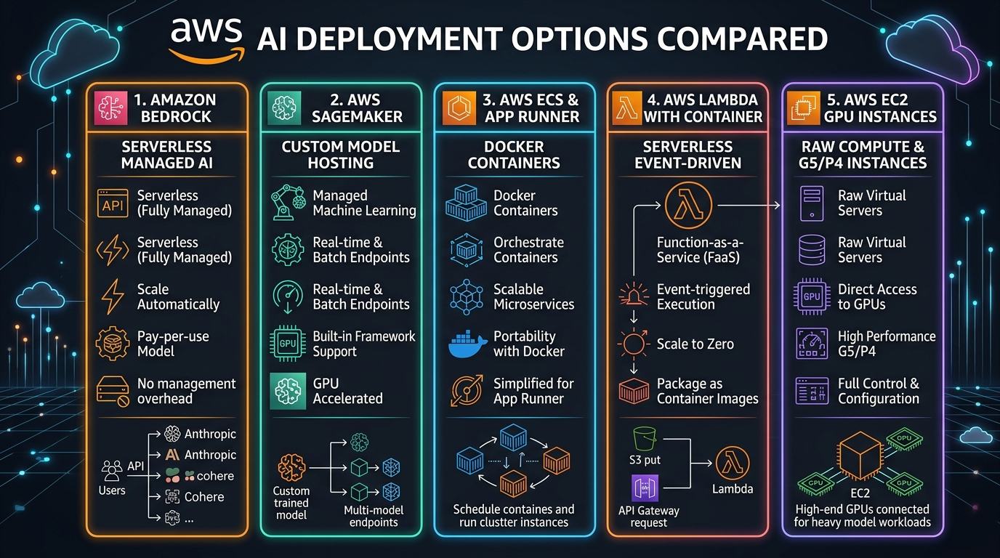
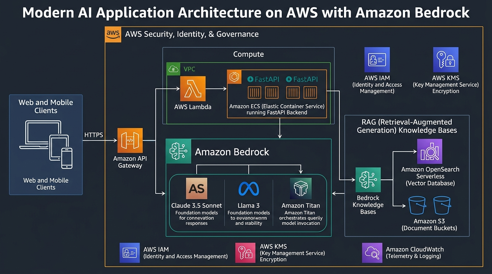
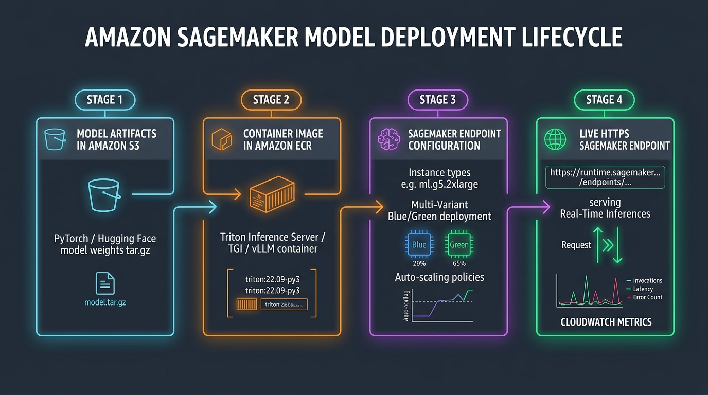
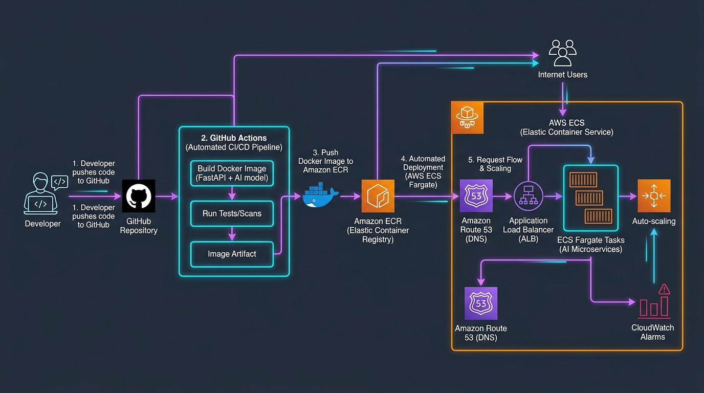

# ☁️ Day 05 — Deploying AI Models & GenAI Applications into AWS from Scratch

> **Zero to Hero Gen AI Course — Phase 01: GenAI Foundations**
>
> 📅 Day 5 of 50 | ⏱️ Estimated Reading Time: 65 minutes
>
> **What you will learn today:** How to take Generative AI models and applications from local notebooks into production on Amazon Web Services (AWS). We cover all 5 deployment pathways — from serverless Foundation Models on Amazon Bedrock to custom GPU model hosting on Amazon SageMaker, containerized microservices on AWS App Runner/ECS, serverless Lambda with Mangum, and raw EC2 GPU clusters with vLLM. Includes production-ready code, Dockerfiles, IAM policies, and architecture diagrams.

---

## 📑 Table of Contents

1. [Why AI Cloud Deployment is Fundamentally Different](#1-why-ai-cloud-deployment-is-fundamentally-different)
2. [The 5 AWS AI Deployment Pathways Compared](#2-the-5-aws-ai-deployment-pathways-compared)
3. [Pathway 1: Serverless GenAI with Amazon Bedrock](#3-pathway-1-serverless-genai-with-amazon-bedrock)
   - [3.1 Model Access & IAM Permissions](#31-model-access--iam-permissions)
   - [3.2 Invoking Models via Python Boto3 (Converse API)](#32-invoking-models-via-python-boto3-converse-api)
   - [3.3 Real-Time Token Streaming (Server-Sent Events)](#33-real-time-token-streaming-server-sent-events)
   - [3.4 Enterprise Guardrails & Content Safety](#34-enterprise-guardrails--content-safety)
   - [3.5 Bedrock Knowledge Bases (Managed RAG)](#35-bedrock-knowledge-bases-managed-rag)
4. [Pathway 2: Custom Model Deployment on Amazon SageMaker](#4-pathway-2-custom-model-deployment-on-amazon-sagemaker)
   - [4.1 Model Packaging & S3 Storage](#41-model-packaging--s3-storage)
   - [4.2 SageMaker Deep Learning Containers (TGI & vLLM)](#42-sagemaker-deep-learning-containers-tgi--vllm)
   - [4.3 Real-Time, Serverless, and Asynchronous Endpoints](#43-real-time-serverless-and-asynchronous-endpoints)
   - [4.4 Python Deployment Automation with Boto3](#44-python-deployment-automation-with-boto3)
   - [4.5 Auto-Scaling & Cost Safeguards](#45-auto-scaling--cost-safeguards)
5. [Pathway 3: Containerized AI Microservices (Docker + AWS ECS / App Runner)](#5-pathway-3-containerized-ai-microservices-docker--aws-ecs--app-runner)
   - [5.1 Designing the FastAPI Serving Layer](#51-designing-the-fastapi-serving-layer)
   - [5.2 Multi-Stage Production Dockerfile](#52-multi-stage-production-dockerfile)
   - [5.3 Pushing to Amazon ECR (Elastic Container Registry)](#53-pushing-to-amazon-ecr-elastic-container-registry)
   - [5.4 Deploying on AWS App Runner (Zero-Ops)](#54-deploying-on-aws-app-runner-zero-ops)
   - [5.5 Deploying on AWS ECS Fargate with ALB](#55-deploying-on-aws-ecs-fargate-with-alb)
6. [Pathway 4: Serverless Event-Driven AI (AWS Lambda + API Gateway)](#6-pathway-4-serverless-event-driven-ai-aws-lambda--api-gateway)
   - [6.1 Lambda Container Images (Up to 10GB)](#61-lambda-container-images-up-to-10gb)
   - [6.2 The Mangum ASGI Adapter](#62-the-mangum-asgi-adapter)
   - [6.3 Mitigating Cold Starts with Provisioned Concurrency](#63-mitigating-cold-starts-with-provisioned-concurrency)
7. [Pathway 5: High-Performance GPU Hosting on Amazon EC2 (vLLM & TGI)](#7-pathway-5-high-performance-gpu-hosting-on-amazon-ec2-vllm--tgi)
   - [7.1 EC2 GPU Instance Families (G5, G6, P4d, Inf2)](#71-ec2-gpu-instance-families-g5-g6-p4d-inf2)
   - [7.2 Setting up AWS Deep Learning AMIs (DLAMI)](#72-setting-up-aws-deep-learning-amis-dlami)
   - [7.3 Serving 100x Faster with vLLM & PagedAttention](#73-serving-100x-faster-with-vllm--pagedattention)
8. [Cloud Security, IAM & Private Networking](#8-cloud-security-iam--private-networking)
   - [8.1 Least-Privilege IAM Policies](#81-least-privilege-iam-policies)
   - [8.2 VPC Endpoints (AWS PrivateLink)](#82-vpc-endpoints-aws-privatelink)
   - [8.3 Secrets Management & KMS Encryption](#83-secrets-management--kms-encryption)
9. [Observability, Monitoring & Cost Governance](#9-observability-monitoring--cost-governance)
   - [9.1 CloudWatch Metrics & Dashboards](#91-cloudwatch-metrics--dashboards)
   - [9.2 Cost Optimization: Spot Instances, Quantization & Savings Plans](#92-cost-optimization-spot-instances-quantization--savings-plans)
10. [Hands-On Project: Deploying the Enterprise AI Serving Gateway](#10-hands-on-project-deploying-the-enterprise-ai-serving-gateway)
11. [Key Takeaways & Architecture Decision Checklist](#11-key-takeaways--architecture-decision-checklist)
12. [Curated Video Walkthroughs & Visual Animations](#12-curated-video-walkthroughs--visual-animations)
13. [Practice Questions & Real-World Interview Scenarios](#13-practice-questions--real-world-interview-scenarios)

---

## 1. Why AI Cloud Deployment is Fundamentally Different

Deploying traditional web applications (like Django, Node.js, or Spring Boot) is well understood: compile the code, put it into a small 50MB Docker image, deploy it to a CPU cluster, and scale based on CPU/RAM metrics.

**Generative AI and Large Language Models (LLMs) completely break these assumptions:**

| Dimension | Traditional Web App | GenAI / LLM Workload | Cloud Implication |
|---|---|---|---|
| **Resource Bottleneck** | CPU & RAM | **GPU VRAM & Memory Bandwidth** | Must provision specialized GPU instances (NVIDIA A10G, H100, L4) costing \$1–\$30/hr. |
| **Artifact Size** | 20MB – 200MB | **5GB – 140GB+ per model** | Traditional container registries and fast restarts fail; weights must be cached on NVMe storage. |
| **Request Latency** | 20ms – 200ms | **500ms – 15,000ms+** | HTTP timeouts trigger prematurely; streaming (SSE/WebSockets) is mandatory for UX. |
| **Compute Scaling** | Scale on CPU > 70% | **Scale on Invocations & Token Queues** | CPU usage is irrelevant; scaling must monitor queue depth and GPU memory. |
| **Statefulness** | Stateless HTTP requests | **KV-Cache (Key-Value Cache)** | Re-evaluating previous tokens is expensive; modern serving engines cache attention states. |
| **Cost Profile** | \$20–\$100 / month | **\$500–\$10,000+ / month** | Idle GPU instances quickly bleed budgets; scale-to-zero or serverless tokens are vital. |

---

## 2. The 5 AWS AI Deployment Pathways Compared

AWS provides five distinct pathways to deploy AI models. Choosing the right one determines your monthly cloud bill, latency, and operational overhead:



### Architectural Comparison Matrix

| Deployment Pathway | Best For | Typical Latency | Cost Model | Operational Overhead | Custom Weights? |
|---|---|---|---|---|---|
| **1. Amazon Bedrock** | Proprietary & open foundation models (Claude 3.5, Llama 3, Titan) | Ultra-low (Managed API) | Pay-per-token (Serverless) | **Zero (Serverless)** | No (Pretrained + Fine-tuned via Bedrock) |
| **2. AWS SageMaker** | Dedicated production model endpoints with custom PyTorch/HF code | 50ms – 500ms | Hourly per GPU instance + data transfer | **Low to Medium** | **Yes (Full control)** |
| **3. AWS App Runner / ECS** | Full-stack AI APIs, RAG pipelines, FastAPI backends, LangChain agents | 100ms – 1s | Hourly per vCPU/GB RAM (Fargate) | **Medium** | Yes (Lightweight or API-backed) |
| **4. AWS Lambda + API Gateway** | Event-driven AI, async batch tasks, webhooks, lightweight ONNX | 200ms (Warm) / 3s+ (Cold) | Pay-per-millisecond of execution | **Zero (Serverless)** | Limited (<= 10GB container image) |
| **5. Amazon EC2 GPU (vLLM)** | Maximum throughput, high-concurrency LLM serving, proprietary infra | Lowest possible (<50ms) | Fixed hourly instance cost (e.g. G5/P4) | **High (Full OS/Driver management)** | **Yes (Unrestricted)** |

---

## 3. Pathway 1: Serverless GenAI with Amazon Bedrock

Amazon Bedrock is a fully managed serverless service that provides high-performing Foundation Models (FMs) from leading AI companies (Anthropic, Meta, Mistral, Cohere, and Amazon) via a single unified API.



> ### 🎥 Visual Explainer & Animation
> [](https://www.youtube.com/watch?v=loOIG0-cL3Q)
>
> 🎬 **[Cameron McKenzie — What is Amazon Bedrock? Generative AI on AWS for Beginners](https://www.youtube.com/watch?v=loOIG0-cL3Q)** (⏱️ 14 mins)  
> 💡 *Visual Highlights:* Comprehensive architectural walkthrough breaking down serverless foundation model access, IAM policies, and how Amazon Bedrock serves GenAI models.

### Why Enterprise Engineering Teams Choose Bedrock
1. **Zero Infrastructure Management:** No GPUs to provision, no CUDA drivers, no server patching.
2. **Data Privacy Guarantee:** Your data is never used to train the base foundation models, and all data remains encrypted within your AWS VPC and region.
3. **Unified API (Converse API):** One consistent JSON schema works across Claude 3.5 Sonnet, Llama 3, Mistral Large, and Amazon Titan.

---

### 3.1 Model Access & IAM Permissions

Before making API calls to Amazon Bedrock, you must enable model access in the AWS Console (**AWS Console ➔ Amazon Bedrock ➔ Model Access ➔ Request Access**).

#### Minimal Least-Privilege IAM Policy for Bedrock:
```json
{
  "Version": "2012-10-17",
  "Statement": [
    {
      "Sid": "BedrockInvokeModelAccess",
      "Effect": "Allow",
      "Action": [
        "bedrock:InvokeModel",
        "bedrock:InvokeModelWithResponseStream"
      ],
      "Resource": [
        "arn:aws:bedrock:*::foundation-model/anthropic.claude-3-5-sonnet-20240620-v1:0",
        "arn:aws:bedrock:*::foundation-model/meta.llama3-70b-instruct-v1:0",
        "arn:aws:bedrock:*::foundation-model/amazon.titan-embed-text-v1"
      ]
    }
  ]
}
```

---

### 3.2 Invoking Models via Python Boto3 (Converse API)

> ### 🎥 Visual Explainer & Animation
> [](https://www.youtube.com/watch?v=vQ9BUc-UmXY)
>
> 🎬 **[Be A Better Dev — AWS Lambda + Bedrock Tutorial: Building Serverless GenAI](https://www.youtube.com/watch?v=vQ9BUc-UmXY)** (⏱️ 20 mins)  
> 💡 *Visual Highlights:* Step-by-step walkthrough writing Boto3 code, setting up IAM execution roles, querying Claude, and connecting Bedrock to serverless endpoints.

The modern AWS SDK (`boto3>=1.34.0`) provides the **Bedrock Converse API**, which standardizes message structure across all providers:

```python
import boto3
from botocore.config import Config

# Configure client with adaptive retry policy
config = Config(
    region_name="us-east-1",
    retries={"max_attempts": 3, "mode": "adaptive"}
)
client = boto3.client("bedrock-runtime", config=config)

response = client.converse(
    modelId="anthropic.claude-3-5-sonnet-20240620-v1:0",
    messages=[
        {
            "role": "user",
            "content": [{"text": "Explain AWS Fargate vs Lambda for deploying AI applications."}]
        }
    ],
    system=[{"text": "You are a Principal Cloud Solutions Architect."}],
    inferenceConfig={
        "maxTokens": 1000,
        "temperature": 0.4,
        "topP": 0.9
    }
)

# Extract generated response text
output_text = response["output"]["message"]["content"][0]["text"]
token_usage = response["usage"]

print(f"Response:\n{output_text}")
print(f"\nTokens Consumed: In={token_usage['inputTokens']}, Out={token_usage['outputTokens']}")
```

---

### 3.3 Real-Time Token Streaming (Server-Sent Events)

When generating long responses, waiting 10 seconds for the entire completion destroys user experience. Bedrock provides token streaming via `converse_stream`:

```python
response_stream = client.converse_stream(
    modelId="anthropic.claude-3-5-sonnet-20240620-v1:0",
    messages=[{"role": "user", "content": [{"text": "Write a complete tutorial on AWS Docker deployment."}]}],
    inferenceConfig={"maxTokens": 2048, "temperature": 0.5}
)

for event in response_stream.get("stream", []):
    if "contentBlockDelta" in event:
        delta = event["contentBlockDelta"]["delta"]
        if "text" in delta:
            print(delta["text"], end="", flush=True)
```

---

### 3.4 Enterprise Guardrails & Content Safety

**Amazon Bedrock Guardrails** allows organizations to enforce automated safety policies across foundation models:
- **Denied Topics:** Block sensitive internal discussions (e.g., salary negotiation, unauthorized legal advice).
- **Content Filters:** Detect and block hate speech, insults, sexual content, and violence.
- **Sensitive Information Filters (PII Masking):** Automatically redact Social Security numbers, credit card numbers, phone numbers, and AWS access keys from both user prompts and model responses.

---

### 3.5 Bedrock Knowledge Bases (Managed RAG)

Amazon Bedrock Knowledge Bases automates the entire Retrieval-Augmented Generation (RAG) lifecycle without needing custom chunking or embedding scripts:
1. **Data Ingestion:** Point Bedrock to an **Amazon S3** bucket containing enterprise documents (PDFs, Word docs, CSV, Markdown).
2. **Automated Vectorization:** Bedrock automatically chunks the text, computes embeddings using **Amazon Titan Embeddings**, and indexes them into **Amazon OpenSearch Serverless**.
3. **RetrieveAndGenerate API:** In a single API call, Bedrock queries the vector index, retrieves the top $k$ relevant passages, and feeds them as grounded context to Claude 3.5 Sonnet.

---

## 4. Pathway 2: Custom Model Deployment on Amazon SageMaker

When you train your own proprietary models, fine-tune an open-source model (e.g. with LoRA), or need dedicated throughput, **Amazon SageMaker** is the gold standard:



> ### 🎥 Visual Explainer & Animation
> [](https://www.youtube.com/watch?v=rIAQ5BppDpk)
>
> 🎬 **[Ram Vegiraju — Deploy SageMaker Endpoints Using Infrastructure as Code](https://www.youtube.com/watch?v=rIAQ5BppDpk)** (⏱️ 15 mins)  
> 💡 *Visual Highlights:* Step-by-step console and SDK walkthrough illustrating how model weights in S3 are deployed to real-time HTTPS inference endpoints with CloudFormation and Python.

### 4.1 Model Packaging & S3 Storage

SageMaker requires model artifacts to be stored in Amazon S3 as a gzip-compressed tar archive (`model.tar.gz`):

```
model.tar.gz
├── config.json
├── pytorch_model.bin (or model.safetensors)
├── tokenizer.json
├── tokenizer_config.json
└── code/
    ├── inference.py     # Custom inference script (model_fn, predict_fn)
    └── requirements.txt # Optional custom pip dependencies
```

The custom `code/inference.py` script implements four lifecycle hooks:
```python
import json
import torch
from transformers import AutoModelForCausalLM, AutoTokenizer

def model_fn(model_dir):
    """Load model and tokenizer into GPU memory when the container starts."""
    tokenizer = AutoTokenizer.from_pretrained(model_dir)
    model = AutoModelForCausalLM.from_pretrained(
        model_dir,
        torch_dtype=torch.float16,
        device_map="auto"
    )
    return {"model": model, "tokenizer": tokenizer}

def predict_fn(data, model_artifacts):
    """Execute forward inference pass on incoming HTTP requests."""
    model = model_artifacts["model"]
    tokenizer = model_artifacts["tokenizer"]
    prompt = data.get("inputs", "")
    
    inputs = tokenizer(prompt, return_tensors="pt").to("cuda")
    with torch.no_grad():
        output = model.generate(**inputs, max_new_tokens=128)
    return tokenizer.decode(output[0], skip_special_tokens=True)
```

---

### 4.2 SageMaker Deep Learning Containers (TGI & vLLM)

Instead of writing custom PyTorch serving code from scratch, AWS partners with Hugging Face to provide pre-built **Deep Learning Containers (DLCs)** powered by **Text Generation Inference (TGI)** and **vLLM**:
- Continuous dynamic request batching.
- PagedAttention for zero memory waste in KV-caching.
- Optimized CUDA kernels for FlashAttention-2.

---

### 4.3 Real-Time vs Serverless vs Asynchronous Endpoints

| Endpoint Type | Scale-to-Zero? | Timeout Limit | Max Payload | Best Use Case |
|---|---|---|---|---|
| **Real-Time Endpoint** | No (Always warm GPU) | 60 seconds | 6 MB | High-traffic, latency-critical production user requests. |
| **Serverless Inference** | **Yes (0 instances when idle)** | 60 seconds | 4 MB | Spiky traffic, dev/staging environments, internal tools. |
| **Asynchronous Inference** | Yes (via autoscaling) | **15 minutes** | **1 GB (S3 backed)** | Batch processing, large document analysis, video/audio AI. |

---

## 5. Pathway 3: Containerized AI Microservices (Docker + AWS ECS / App Runner)

For enterprise microservices that wrap AI logic with business rules, authentication, and database calls, containerizing a **FastAPI** application is the industry standard:



> ### 🎥 Visual Explainer & Animation
> [](https://www.youtube.com/watch?v=zs3tyVgiBQQ)
>
> 🎬 **[TechWorld with Nana — Docker Containers and AWS ECS Deployment Explained](https://www.youtube.com/watch?v=zs3tyVgiBQQ)** (⏱️ 28 mins)  
> 💡 *Visual Highlights:* Visual animation of Docker images, pushing to Amazon ECR, configuring Task Definitions, and running serverless containers on AWS Fargate.

### 5.1 Designing the FastAPI Serving Layer

A robust AI API must include:
1. **Health Check Probes (`/health`):** Required by AWS Application Load Balancers (ALB) to know if the container is ready to accept traffic.
2. **Streaming Endpoints (`/v1/chat/stream`):** Delivers Server-Sent Events (SSE) so users see tokens immediately.
3. **Structured Request/Response Validation:** Powered by Pydantic V2.

*(See [`hands_on_project/app.py`](file:///c:/Users/sriva/OneDrive/Desktop/GEN%20AI%20COURSE/Python/Phase_01_GenAI_Foundations/Day_05_Deploying_AI_on_AWS/hands_on_project/app.py) for the complete implementation).*

---

### 5.2 Multi-Stage Production Dockerfile

Security and image size are paramount. Never run containers as `root`:

```dockerfile
FROM python:3.11-slim as base

ENV PYTHONDONTWRITEBYTECODE=1 \
    PYTHONUNBUFFERED=1 \
    PORT=8000

WORKDIR /app

RUN apt-get update && apt-get install -y --no-install-recommends curl \
    && rm -rf /var/lib/apt/lists/*

COPY requirements.txt .
RUN pip install --no-cache-dir -r requirements.txt

COPY bedrock_client.py app.py lambda_handler.py ./

# Security best practice: Run as non-root user
RUN useradd -m -u 1000 appuser && chown -R appuser:appuser /app
USER appuser

EXPOSE 8000

HEALTHCHECK --interval=30s --timeout=5s --start-period=5s --retries=3 \
    CMD curl -f http://localhost:8000/health || exit 1

CMD ["uvicorn", "app:app", "--host", "0.0.0.0", "--port", "8000"]
```

---

### 5.3 Pushing to Amazon ECR (Elastic Container Registry)

Run these commands in PowerShell or Bash:

```bash
# 1. Authenticate Docker CLI to your AWS ECR Registry
aws ecr get-login-password --region us-east-1 | docker login --username AWS --password-stdin <ACCOUNT_ID>.dkr.ecr.us-east-1.amazonaws.com

# 2. Create the ECR Repository (if not already created)
aws ecr create-repository --repository-name aws-ai-gateway --region us-east-1

# 3. Build and Tag the Container
docker build -t aws-ai-gateway:latest .
docker tag aws-ai-gateway:latest <ACCOUNT_ID>.dkr.ecr.us-east-1.amazonaws.com/aws-ai-gateway:latest

# 4. Push Image to ECR
docker push <ACCOUNT_ID>.dkr.ecr.us-east-1.amazonaws.com/aws-ai-gateway:latest
```

---

### 5.4 Deploying on AWS App Runner (Zero-Ops)

**AWS App Runner** is the fastest path to production for containerized APIs:
- Automatically provisions HTTPS with valid SSL certificates.
- Automatically handles load balancing and horizontal auto-scaling (1 to 25 instances).
- Integrates directly with ECR.

---

### 5.5 Deploying on AWS ECS Fargate with ALB

For corporate VPCs requiring internal networking, AWS WAF firewall protection, and multi-service routing, **AWS ECS with AWS Fargate** provides:
- Serverless container execution (no EC2 instances to patch).
- Automatic task placement across multiple Availability Zones (AZs).
- Direct IAM Task Role assignment for secure Boto3 Bedrock access.

---

## 6. Pathway 4: Serverless Event-Driven AI (AWS Lambda + API Gateway)

> ### 🎥 Visual Explainer & Animation
> [](https://www.youtube.com/watch?v=1_AlV-FFxM8)
>
> 🎬 **[Be A Better Dev — Learn Docker & Deploy to AWS - Beginner Tutorial](https://www.youtube.com/watch?v=1_AlV-FFxM8)** (⏱️ 18 mins)  
> 💡 *Visual Highlights:* Clear visual guide packaging Python applications into container images, pushing to ECR, and deploying serverless compute workloads on AWS.

Can you run AI on **AWS Lambda**?
- **Classic Lambda:** Limited to 250MB uncompressed zip file (cannot fit PyTorch or large models).
- **Modern Lambda (Container Images):** Supports container images up to **10 GB**!

### The Mangum ASGI Adapter

Using **Mangum**, you can deploy the exact same FastAPI application to AWS Lambda with zero code rewrites:

```python
# lambda_handler.py
from mangum import Mangum
from app import app

# Mangum adapts API Gateway HTTP events to ASGI ASGI requests
handler = Mangum(app, lifespan="off")
```

When an HTTP request hits Amazon API Gateway, it invokes the Lambda container, Mangum translates the event into an ASGI request, FastAPI handles it, and Mangum converts the response back to API Gateway format.

---

## 7. Pathway 5: High-Performance GPU Hosting on Amazon EC2 (vLLM & TGI)

For high-throughput applications requiring hundreds of tokens per second, raw **Amazon EC2 GPU Instances** running **vLLM** provide maximum performance:

### 7.1 EC2 GPU Instance Families

| Instance Family | GPU Model | VRAM per GPU | On-Demand Price (us-east-1) | Ideal Workloads |
|---|---|---|---|---|
| **g5.xlarge** | 1x NVIDIA A10G | 24 GB | ~\$1.006 / hr | 7B – 13B models (FP16 or 4-bit quantized) |
| **g5.12xlarge** | 4x NVIDIA A10G | 96 GB (Total) | ~\$5.672 / hr | 70B models (AWQ / GPTQ quantized) |
| **g6.xlarge** | 1x NVIDIA L4 | 24 GB | ~\$0.804 / hr | High efficiency inference |
| **p4d.24xlarge**| 8x NVIDIA A100 | 320 GB (Total) | ~\$32.77 / hr | Full precision 70B+ inference & fine-tuning |
| **inf2.xlarge** | 1x AWS Inferentia2 | 32 GB Neuron | ~\$0.758 / hr | Cost-optimized inference with AWS Neuron SDK |

---

### 7.3 Serving 100x Faster with vLLM & PagedAttention

vLLM solves the primary bottleneck in LLM serving: **GPU memory fragmentation from Key-Value (KV) caching**.

To launch a production vLLM server on an EC2 G5 instance:

```bash
# Launch OpenAI-compatible vLLM serving engine on port 8000
python -m vllm.entrypoints.openai.api_server \
    --model mistralai/Mistral-7B-Instruct-v0.2 \
    --tensor-parallel-size 1 \
    --gpu-memory-utilization 0.90 \
    --max-model-len 4096 \
    --port 8000
```
This automatically provides standard `/v1/chat/completions` endpoints that any LangChain, LlamaIndex, or OpenAI SDK application can consume directly!

---

## 8. Cloud Security, IAM & Private Networking

Enterprise cloud deployments must adhere to the **Principle of Least Privilege**:

### 8.1 Least-Privilege IAM Policies

Never use `AdministratorAccess` or hardcode AWS Access Keys (`AKIA...`) in source code or Docker images! Instead:
- Use **ECS Task Roles** for ECS containers.
- Use **Instance Profiles** for EC2 instances.
- Use **Lambda Execution Roles** for Lambda functions.

The AWS SDK (`boto3`) automatically retrieves temporary security credentials from the instance metadata service (IMDSv2).

---

### 8.2 VPC Endpoints (AWS PrivateLink)

In strict corporate environments, AI API traffic must never traverse the public internet. By creating **VPC Interface Endpoints (AWS PrivateLink)** for Amazon Bedrock and SageMaker:
- Traffic flows entirely across AWS's private high-speed backbone.
- VPC Route Tables block all outbound internet gateways (0.0.0.0/0).
- Prevents data leakage and satisfies HIPAA, SOC2, and PCI-DSS compliance.

---

## 9. Observability, Monitoring & Cost Governance

Running AI in production without monitoring is a recipe for catastrophic cloud bills.

### 9.1 Essential CloudWatch Metrics

| Metric | Target Service | Warning Threshold | Meaning |
|---|---|---|---|
| `ModelLatency` | SageMaker | > 2,000 ms | Time spent inside model forward pass. |
| `OverheadLatency` | SageMaker | > 50 ms | Network and container deserialization lag. |
| `GPUUtilization` | EC2 / SageMaker | < 10% (Waste) / > 95% (Queue) | Hardware compute efficiency. |
| `GPUMemoryUtilization` | EC2 / SageMaker | > 92% | Impending Out-Of-Memory (OOM) crash risk. |
| `5XXError` | Bedrock / SageMaker | > 1% | Model crashes, timeouts, or quota throttles. |

---

### 9.2 Cost Optimization Checklist

1. **Spot Instances for Non-Critical Workloads:** Save up to **70%** on EC2 GPU training and batch inference using AWS Spot Instances.
2. **Scale to Zero with Bedrock & Serverless:** For internal tools used only during business hours (9 AM – 5 PM), running a 24/7 dedicated GPU instance wastes 65% of your money. Use Bedrock or SageMaker Serverless.
3. **Model Quantization (AWQ / GPTQ / GGUF):** Quantizing a 70B parameter model from FP16 (140GB VRAM) to INT4 (35GB VRAM) allows it to run on a single `g5.12xlarge` instead of an expensive multi-GPU cluster.
4. **AWS Compute Savings Plans:** Commit to 1 or 3 years of consistent compute usage for up to **45% discounts** on EC2 and SageMaker instances.

---

## 10. Hands-On Project: Deploying the Enterprise AI Serving Gateway

In your workspace, navigate to [`Day_05_Deploying_AI_on_AWS/hands_on_project/`](file:///c:/Users/sriva/OneDrive/Desktop/GEN%20AI%20COURSE/Python/Phase_01_GenAI_Foundations/Day_05_Deploying_AI_on_AWS/hands_on_project/):

### Quick Test Commands:

1. **Install requirements:**
   ```powershell
   cd "Python\Phase_01_GenAI_Foundations\Day_05_Deploying_AI_on_AWS\hands_on_project"
   pip install -r requirements.txt
   ```

2. **Launch the FastAPI Gateway:**
   ```powershell
   python app.py
   ```

3. **Verify the Health Probe:**
   ```powershell
   curl http://localhost:8000/health
   ```
   *Returns:*
   ```json
   {"status":"healthy","region":"us-east-1","mode":"mock","timestamp":1727788800.0}
   ```

4. **Test Live Generation via Swagger UI:**
   Open your browser to: **`http://localhost:8000/docs`**
   - Click `/v1/chat/completions` ➔ **Try it out** ➔ Execute!

---

## 11. Key Takeaways & Architecture Decision Checklist

```
                      Do you need custom fine-tuned weights?
                                    │
                    ┌───────────────┴───────────────┐
                    ▼                               ▼
                   NO                              YES
           (Standard Foundation)            (Custom PyTorch/HF)
                    │                               │
       Use Amazon Bedrock (Converse API)            │
       • Serverless tokens                          ▼
       • Claude 3.5, Llama 3, Titan         What is your traffic pattern?
       • Built-in Guardrails & RAG                  │
                                     ┌──────────────┴──────────────┐
                                     ▼                             ▼
                                  SPIKY / LOW                   STEADY / HIGH
                           (Dev, Staging, Internal)       (Production High Throughput)
                                     │                             │
                           SageMaker Serverless           SageMaker Real-Time
                                    OR                            OR
                           AWS Lambda (Container)         EC2 GPU with vLLM
```

---

## 12. Curated Video Walkthroughs & Visual Animations

To visually internalize how Amazon Bedrock orchestrates foundation models, how SageMaker hosts real-time endpoints, and how Docker microservices deploy to AWS ECS and serverless compute, watch these top-rated video walkthroughs:

| # | Topic / Concept | Recommended Video | Channel / Creator | Why Watch? (Visual & Animation Highlights) |
|---|-----------------|-------------------|-------------------|--------------------------------------------|
| 1 | **What is Amazon Bedrock?** | [What is Amazon Bedrock? Generative AI on AWS for Beginners](https://www.youtube.com/watch?v=loOIG0-cL3Q) | **Cameron McKenzie** | Architectural walkthrough breaking down serverless foundation model access, IAM policies, and how Amazon Bedrock serves GenAI models. |
| 2 | **Serverless Bedrock with Python** | [AWS Lambda + Bedrock Tutorial: Building Serverless GenAI](https://www.youtube.com/watch?v=vQ9BUc-UmXY) | **Be A Better Dev** | Step-by-step walkthrough writing Boto3 code, setting up IAM execution roles, querying Claude, and connecting Bedrock to serverless endpoints. |
| 3 | **Docker to AWS ECS & ECR** | [How to Deploy a Docker App to AWS using Elastic Container Service (ECS)](https://www.youtube.com/watch?v=zs3tyVgiBQQ) | **Be A Better Dev** | Comprehensive walkthrough packaging a Docker app, pushing to Amazon ECR, configuring Task Definitions, and running serverless containers on AWS Fargate. |
| 4 | **Amazon SageMaker Endpoints** | [Deploy SageMaker Endpoints Using Infrastructure as Code](https://www.youtube.com/watch?v=rIAQ5BppDpk) | **Ram Vegiraju** | Step-by-step console and SDK walkthrough illustrating how model weights in S3 are deployed to real-time HTTPS inference endpoints with CloudFormation and Python. |
| 5 | **Learn Docker & Deploy to AWS** | [Learn Docker & Deploy to AWS - Beginner Tutorial](https://www.youtube.com/watch?v=1_AlV-FFxM8) | **Be A Better Dev** | Clear visual guide packaging Python applications into container images, pushing to ECR, and deploying serverless compute workloads on AWS. |

### 🎬 Deep-Dive Video Breakdown

#### 1. [Cameron McKenzie — What is Amazon Bedrock? Generative AI on AWS for Beginners](https://www.youtube.com/watch?v=loOIG0-cL3Q)
[](https://www.youtube.com/watch?v=loOIG0-cL3Q)
> ⏱️ **Duration:** ~14 mins | 🎯 **Core Concept:** Enterprise GenAI, Data Isolation, Foundation Models, Bedrock Console  
> 💡 **Key Visual Takeaway:** Watch the architecture explanation showing how Bedrock keeps customer data isolated within AWS PrivateLink, ensuring prompts never traverse the public web or train external models.

#### 2. [Be A Better Dev — AWS Lambda + Bedrock Tutorial: Building Serverless GenAI](https://www.youtube.com/watch?v=vQ9BUc-UmXY)
[](https://www.youtube.com/watch?v=vQ9BUc-UmXY)
> ⏱️ **Duration:** ~20 mins | 🎯 **Core Concept:** Boto3 Client Setup, IAM Permissions, Model Invocation  
> 💡 **Key Visual Takeaway:** Clear, no-nonsense screen capture demonstrating how to enable Model Access in the AWS Management Console and execute Python test invocations with Claude.

#### 3. [Be A Better Dev — How to Deploy a Docker App to AWS ECS](https://www.youtube.com/watch?v=zs3tyVgiBQQ)
[](https://www.youtube.com/watch?v=zs3tyVgiBQQ)
> ⏱️ **Duration:** ~25 mins | 🎯 **Core Concept:** ECR, ECS Clusters, Task Definitions, Fargate Autoscaling  
> 💡 **Key Visual Takeaway:** Architecture walkthrough showing how container images in Amazon ECR are pulled into ECS Task Definitions and served behind an Application Load Balancer.

#### 4. [Ram Vegiraju — Deploy SageMaker Endpoints Using Infrastructure as Code](https://www.youtube.com/watch?v=rIAQ5BppDpk)
[](https://www.youtube.com/watch?v=rIAQ5BppDpk)
> ⏱️ **Duration:** ~15 mins | 🎯 **Core Concept:** SageMaker Endpoints, `model.tar.gz`, Deep Learning Containers  
> 💡 **Key Visual Takeaway:** Step-by-step console and SDK walkthrough illustrating how model weights in S3 are deployed to real-time HTTPS inference endpoints with CloudFormation and Python.

#### 5. [Be A Better Dev — Learn Docker & Deploy to AWS - Beginner Tutorial](https://www.youtube.com/watch?v=1_AlV-FFxM8)
[](https://www.youtube.com/watch?v=1_AlV-FFxM8)
> ⏱️ **Duration:** ~18 mins | 🎯 **Core Concept:** Containerization, Dockerfile, ECR Push, Serverless Compute  
> 💡 **Key Visual Takeaway:** Practical visual demonstration building a Python Docker container, pushing to ECR, and deploying serverless compute workloads on AWS.

---

## 13. Practice Questions & Real-World Interview Scenarios

### Question 1: How does Amazon Bedrock differ from Amazon SageMaker?
**Answer:** Amazon Bedrock is a fully managed **serverless API** for foundation models (pay per token, zero infrastructure, no GPU management). Amazon SageMaker is a comprehensive **machine learning platform** that lets you train, fine-tune, containerize, and host custom models on dedicated or serverless compute instances with complete control over weights, inference code, and hardware.

### Question 2: What causes cold starts in serverless AI deployments, and how do you mitigate them?
**Answer:** Cold starts occur when a serverless platform (like AWS Lambda or SageMaker Serverless) provisions a new container, pulls the Docker image, initializes the Python runtime, and loads model weights into memory. Mitigations include:
1. **Provisioned Concurrency** to keep pre-warmed worker instances ready.
2. Lightweight model runtimes (ONNX Runtime instead of full PyTorch).
3. Using Amazon Bedrock which abstracts cold starts completely.

### Question 3: Why is vLLM faster than standard Hugging Face `pipeline()` for serving LLMs?
**Answer:** Standard Hugging Face processes requests sequentially and allocates contiguous VRAM for attention Key-Value (KV) caches, resulting in 60–80% memory waste due to fragmentation. vLLM uses **PagedAttention**, which manages KV cache memory like virtual memory pages in operating systems, eliminating fragmentation and enabling continuous batching of concurrent requests for 10x–20x higher throughput.

### Question 4: How do you secure GenAI calls in AWS without internet egress?
**Answer:** Configure **AWS PrivateLink (VPC Endpoints)** for `bedrock-runtime` and `sagemaker.runtime` inside private VPC subnets. Route all API calls internally through private elastic network interfaces (ENIs), blocking internet gateways and NAT gateways.

---

<p align="center">
  <b>Congratulations on completing Phase 01: GenAI Foundations! 🚀</b><br>
  You now have a solid command of LLM architectures, parameters, LangChain agents, structured assessment engines, and enterprise AWS deployments.<br>
  Proceed to <b>Phase 02: Python for AI (Days 6–10)</b> to master high-performance computing with NumPy, Pandas, and Vectorized Data Manipulation!
</p>
