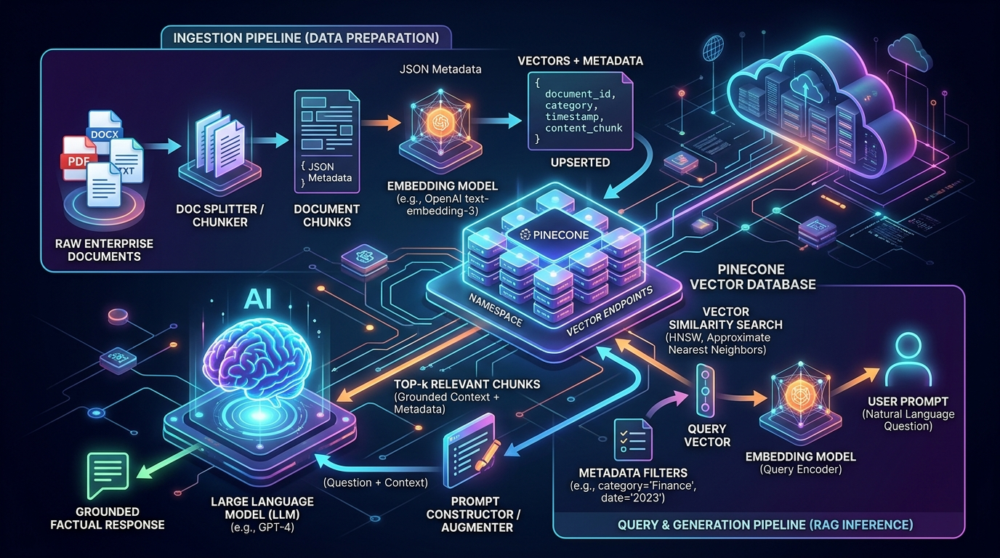

# 🌲 Day 06 — Vector Databases, High-Dimensional Embeddings & Pinecone from Scratch

> **Zero to Hero Gen AI Course — Phase 02: Vector Databases & Retrieval-Augmented Generation (RAG)**
>
> 📅 Day 6 of 50 | ⏱️ Estimated Reading Time: 65 minutes
>
> **What you will learn today:** The complete engineering and mathematical foundation of Vector Databases and High-Dimensional Embeddings. We cover vector mathematics (dot product, cosine similarity, Euclidean distance), traditional sparse vectorization (BoW, TF-IDF, N-Grams, OHE) versus deep learning dense embeddings (Word2Vec, GloVe, FastText, ELMo, BERT), binary floating-point representation, why traditional relational databases collapse on unstructured data, vector indexing algorithms (HNSW, IVF, PQ), and a production-grade practical implementation using **Pinecone Vector DB** with multi-provider embeddings and an offline fallback engine.

---

## 📑 Table of Contents

1. [What is a Vector Database & Why Do We Need It?](#1-what-is-a-vector-database--why-do-we-need-it)
   - [1.1 The Unstructured Data Explosion (80–85% of Global Data)](#11-the-unstructured-data-explosion-8085-of-global-data)
   - [1.2 Why Relational Databases (RDBMS) Fail for Embeddings](#12-why-relational-databases-rdbms-fail-for-embeddings)
2. [What is a Vector Embedding?](#2-what-is-a-vector-embedding)
   - [2.1 The Semantic Bridge: From Human Concepts to High-Dimensional Coordinates](#21-the-semantic-bridge-from-human-concepts-to-high-dimensional-coordinates)
   - [2.2 Why Large Language Models Require Embeddings](#22-why-large-language-models-require-embeddings)
3. [The Mathematics of Vectors & High-Dimensional Geometry](#3-the-mathematics-of-vectors--high-dimensional-geometry)
   - [3.1 Coordinates in 1D, 2D, 3D, and N-Dimensional Space](#31-coordinates-in-1d-2d-3d-and-n-dimensional-space)
   - [3.2 Vector Magnitude (L2 Norm) & Unit Vectors](#32-vector-magnitude-l2-norm--unit-vectors)
   - [3.3 Vector Arithmetic: Addition, Subtraction & Semantic Analogy](#33-vector-arithmetic-addition-subtraction--semantic-analogy)
   - [3.4 Similarity & Distance Metrics Compared](#34-similarity--distance-metrics-compared)
4. [Encoding & Vectorization Paradigms (Classical vs Deep Learning)](#4-encoding--vectorization-paradigms-classical-vs-deep-learning)
   - [4.1 Classical Encoders (Without Deep Learning / Sparse Encoders)](#41-classical-encoders-without-deep-learning--sparse-encoders)
   - [4.2 Modern Encoders (With Deep Learning / Dense Embeddings)](#42-modern-encoders-with-deep-learning--dense-embeddings)
   - [4.3 Comprehensive Comparison: Advantages & Disadvantages](#43-comprehensive-comparison-advantages--disadvantages)
   - [4.4 Binary Numbers, Floating-Point Representation & Quantization](#44-binary-numbers-floating-point-representation--quantization)
5. [Sparse Vectors vs Dense Vectors & The Curse of Dimensionality](#5-sparse-vectors-vs-dense-vectors--the-curse-of-dimensionality)
   - [5.1 Sparse Vectors: Vocabulary, Features, and Exact Keywords](#51-sparse-vectors-vocabulary-features-and-exact-keywords)
   - [5.2 Dense Vectors: Continuous Semantic Latent Space](#52-dense-vectors-continuous-semantic-latent-space)
   - [5.3 Hybrid Search: Combining Sparse (BM25) and Dense (Cosine)](#53-hybrid-search-combining-sparse-bm25-and-dense-cosine)
   - [5.4 Dimensionality & The Curse of Dimensionality](#54-dimensionality--the-curse-of-dimensionality)
6. [Embedding Models & Modern APIs](#6-embedding-models--modern-apis)
   - [6.1 Embedding Models vs Generative Models](#61-embedding-models-vs-generative-models)
   - [6.2 Leading Embedding Models & Benchmarks (MTEB)](#62-leading-embedding-models--benchmarks-mteb)
7. [Vector Indexing & Approximate Nearest Neighbors (ANN)](#7-vector-indexing--approximate-nearest-neighbors-ann)
   - [7.1 Flat Index (Brute-Force kNN)](#71-flat-index-brute-force-knn)
   - [7.2 Inverted File Index (IVF)](#72-inverted-file-index-ivf)
   - [7.3 Hierarchical Navigable Small World (HNSW)](#73-hierarchical-navigable-small-world-hnsw)
   - [7.4 Product Quantization (PQ)](#74-product-quantization-pq)
8. [Core Use Cases of Vector Databases](#8-core-use-cases-of-vector-databases)
   - [8.1 Long-Term Memory for LLMs](#81-long-term-memory-for-llms)
   - [8.2 Semantic Search](#82-semantic-search)
   - [8.3 Similarity Search (Multimodal)](#83-similarity-search-multimodal)
   - [8.4 Recommendation Engines](#84-recommendation-engines)
   - [8.5 Retrieval-Augmented Generation (RAG)](#85-retrieval-augmented-generation-rag)
9. [The Vector Database Landscape & Head-to-Head Comparisons](#9-the-vector-database-landscape--head-to-head-comparisons)
   - [9.1 Pinecone vs ChromaDB: The Definitive Head-to-Head Comparison](#91-pinecone-vs-chromadb-the-definitive-head-to-head-comparison)
10. [Hands-On Practical Implementation: Pinecone & ChromaDB](#10-hands-on-practical-implementation-pinecone--chromadb)
    - [10.1 System Architecture](#101-system-architecture)
    - [10.2 Embedding Engine (`embedding_engine.py`)](#102-embedding-engine-embedding_enginepy)
    - [10.3 Pinecone Manager (`pinecone_manager.py`)](#103-pinecone-manager-pinecone_managerpy)
    - [10.4 ChromaDB Manager (`chroma_manager.py`)](#104-chromadb-manager-chroma_managerpy)
    - [10.5 Running Semantic Search & RAG Retrieval Across Both (`demo.py`)](#105-running-semantic-search--rag-retrieval-across-both-demopy)
11. [Production Best Practices & Cost Optimization](#11-production-best-practices--cost-optimization)
12. [Curated Video Walkthroughs & Visual Animations](#12-curated-video-walkthroughs--visual-animations)
13. [📖 The Ultimate Beginner Jargon Buster: Every Vector & AI Keyword Explained in Plain English (Zero Math Required!)](#13-the-ultimate-beginner-jargon-buster-every-vector--ai-keyword-explained-in-plain-english-zero-math-required)
14. [Practice Questions & Real-World Interview Scenarios](#14-practice-questions--real-world-interview-scenarios)

---

## 1. What is a Vector Database & Why Do We Need It?

A **Vector Database** is a specialized storage and retrieval engine designed from the ground up to store, manage, and query **high-dimensional numerical vectors** (known as *vector embeddings*) with millisecond latency at scale.


> ### 🎥 Visual Explainer & Animation
> [](https://www.youtube.com/watch?v=klTvEwg3oJ4)
>
> 🎬 **[Fireship — Vector databases are so hot right now. WTF are they?](https://www.youtube.com/watch?v=klTvEwg3oJ4)** (⏱️ 6 mins)  
> 💡 *Visual Highlights:* Fast-paced animated breakdown explaining why traditional databases fail at semantic search, how high-dimensional embedding spaces work, and how vector databases act as external long-term memory for LLMs.

---

### 1.1 The Unstructured Data Explosion (80–85% of Global Data)

According to global enterprise data studies (IDC, Gartner), **over 80% to 85% of all digital data created worldwide is unstructured**:

```
┌────────────────────────────────────────────────────────────────────────┐
│                        GLOBAL DATA COMPOSITION                         │
├───────────────────────────────────┬────────────────────────────────────┤
│     STRUCTURED DATA (~15-20%)     │     UNSTRUCTURED DATA (~80-85%)    │
├───────────────────────────────────┼────────────────────────────────────┤
│ • Relational SQL Tables           │ • PDF Reports & Research Papers    │
│ • Numerical Financial Ledgers     │ • Customer Support Conversations   │
│ • Sensor readings (Timestamps)    │ • Audio Records & Podcasts         │
│ • Standardized JSON APIs          │ • Images & Satellite Photography   │
│ • Fits neatly into rows & columns │ • Video Streams & Source Code      │
└───────────────────────────────────┴────────────────────────────────────┘
```

Historically, computers could only search structured data using **exact alphanumeric equality** or pattern matching (`WHERE user_id = 42` or `WHERE name LIKE '%Smith%'`). 

However, humans do not communicate in exact SQL keywords. If a user searches an enterprise knowledge base for:
> *"How do I fix a machine that won't start after a power outage?"*

A traditional database searches for the exact words `"machine"`, `"won't"`, `"start"`, `"power"`. If the relevant engineering manual contains:
> *"Industrial turbine restart procedure following grid voltage collapse"*

The traditional database returns **zero results**, despite the manual being the exact answer! This fundamental mismatch is called the **Semantic Gap**.

> 💡 **Layman's Analogy (The Smart Librarian vs The Strict Clerk):**
> Imagine you walk into a library and ask: *"Where are the books about cute puppies?"*
> - **A Strict Clerk (Relational Database)** searches the card catalog only for the literal letters `"c-u-t-e p-u-p-p-i-e-s"`. If a book is titled *"Adorable Golden Retriever Care"*, the clerk says *"Sorry, we don't have that book"* because the word "puppy" wasn't in the title!
> - **A Smart Librarian (Vector Database)** knows that "puppy", "dog", and "Golden Retriever" all belong to the exact same mental concept. She walks you straight to the dog section in 2 seconds!

---

### 1.2 Why Relational Databases (RDBMS) Fail for Embeddings

Many engineers ask: *"PostgreSQL and MySQL are battle-tested. Can't we just store vectors as arrays in Postgres and run SQL queries?"*

While extensions like `pgvector` exist for moderate scale, standard relational databases fundamentally fail when handling large-scale vector workloads due to four architectural bottlenecks:

| Dimension | Relational Databases (PostgreSQL / MySQL) | Dedicated Vector Databases (Pinecone / Milvus / Qdrant) |
|---|---|---|
| **Query Mechanism** | Exact Match (`=`), Range (`<`, `>`), or Full-Text (`LIKE`) | **Approximate Nearest Neighbor (ANN)** similarity search |
| **Search Objective** | Finding rows where scalar values match a predicate | Finding vectors with the **smallest geometric angular distance** |
| **Indexing Structure** | **B-Tree** / **B+ Tree** (1-dimensional scalar ordering) | **HNSW (Hierarchical Navigable Small World)** / **IVF** graph layers |
| **Computational Cost** | $O(\log N)$ tree traversal for 1D scalars | $O(N \cdot D)$ brute-force distance calculation without specialized ANN graphs |
| **Curse of Dimensionality** | B-Trees degrade into full-table scans when $D > 3$ | Indexes specifically optimized for $D \in [384, 3072]$ |
| **Payload Storage** | Rigid table schemas with fixed column types | Schema-less JSON metadata attached directly to vector IDs |

#### The Math Behind the Failure: The $O(N \cdot D)$ Wall
Suppose your enterprise has $N = 1,000,000$ documents, each represented by an OpenAI vector of $D = 1,536$ floating-point dimensions.

To answer a single search query using standard SQL without an ANN index, the database must compute the dot product between the query vector and **all 1,000,000 stored vectors**:
$$\text{Calculations per Query} = 1,000,000 \times 1,536 = 1,536,000,000 \text{ floating-point operations (FLOPs)}$$

At 100 concurrent queries per second, the database would need to perform **153.6 billion FLOPs every second** just to measure distances, completely exhausting CPU memory bandwidth and causing query latency to spike from milliseconds to tens of seconds!

---

## 2. What is a Vector Embedding?

An **Embedding** is a mathematical mapping that translates discrete human concepts (words, sentences, whole documents, images, audio clips) into a continuous, dense array of real numbers (floats) in a high-dimensional geometric vector space:

$$\mathbf{v} = \begin{bmatrix} e_1, e_2, e_3, \dots, e_D \end{bmatrix} \in \mathbb{R}^D$$

Where:
- $D$ is the **dimensionality** of the embedding (e.g., $D=384$ for `all-MiniLM-L6-v2`, $D=1536$ for OpenAI `text-embedding-3-small`, $D=3072$ for `text-embedding-3-large`).
- Each number $e_i \in [-1.0, 1.0]$ represents an abstract semantic coordinate discovered by the neural network during training.

> 💡 **Layman's Analogy (What are "Dimensions"?):**
> Think of creating a character in a video game (like The Sims or RPGs). 
> - If you have **1 dimension** (1 slider): `Height` (Short to Tall).
> - If you have **2 dimensions** (2 sliders): `Height` + `Eye Color`.
> - If you have **3 dimensions** (3 sliders): `Height` + `Eye Color` + `Muscle Mass`.
> 
> An **embedding model has 1,536 sliders**! Each slider measures a subtle nuance: *"Is it an animal?"*, *"Is it edible?"*, *"Is it a tech term?"*, *"Is it positive or negative?"*. A word's embedding is just the exact position of all 1,536 sliders!

---

### 2.1 The Semantic Bridge: From Human Concepts to High-Dimensional Coordinates

In a well-trained embedding space, **geometric distance mirrors conceptual similarity**:
- Concepts with similar meanings are mapped to coordinates that sit physically close to one another in the vector space.
- Unrelated concepts are mapped to coordinates that point in nearly orthogonal (perpendicular) directions.

```
                    3D SEMANTIC EMBEDDING SPACE
                               ▲ Y (Royalty Axis)
                               │
               👑 King         │         👑 Queen
            [0.21, 0.89, 0.54] │      [0.23, 0.88, 0.12]
                               │
                               │
  ─────────────────────────────┼─────────────────────────────► X (Gender Axis)
                               │
               👨 Man          │         👩 Woman
            [0.19, 0.12, 0.55] │      [0.22, 0.11, 0.14]
                               │
                               ▼
```

Notice the geometric alignment:
- The vector connecting $\vec{\text{Man}}$ to $\vec{\text{Woman}}$ is parallel to the vector connecting $\vec{\text{King}}$ to $\vec{\text{Queen}}$.
- The distance between $\vec{\text{King}}$ and $\vec{\text{Queen}}$ is tiny, while the distance between $\vec{\text{King}}$ and $\vec{\text{Apple}}$ is vast.

---

### 2.2 Why Large Language Models Require Embeddings

Large Language Models (GPT-4, Claude 3.5, Gemini) are fundamentally **neural networks consisting of linear algebra matrix operations**. 

1. **Computers cannot multiply words:** A GPU cannot compute $\text{"Puppy"} \times W_{\text{attention}}$. It can only multiply floating-point matrices.
2. **Context Window Limitations:** You cannot feed 50,000 pages of enterprise documentation into an LLM's context window on every turn. Instead, an embedding model indexes the documentation into a vector database, retrieves only the **top-5 most relevant chunks**, and injects them as grounded context into the prompt (Retrieval-Augmented Generation / RAG).

---

## 3. The Mathematics of Vectors & High-Dimensional Geometry

To master vector databases, you must understand the mathematical principles governing vector spaces, distances, and projections.

---

### 3.1 Coordinates in 1D, 2D, 3D, and N-Dimensional Space

```
1D (Scalar Line):         ──[──•───]──           x = 4.2
                             4.2

2D (Planar Grid):              ▲ Y               v = [3.0, 4.0]
                               │    • [3, 4]
                               └───► X

3D (Spatial Volume):           ▲ Z               v = [2.0, 5.0, 8.0]
                              /│
                             / └───► Y
                            ▼ X

N-D (Hyperspace):        v = [x₁, x₂, x₃, ..., x_D]   (D = 1536)
```

In 1D, 2D, and 3D, we can draw vectors using arrows. In $N$-dimensional space ($N > 3$), we cannot visualize the axes physically, but **all the mathematical formulas for angles, distances, projections, and lengths work identically**.

---

### 3.2 Vector Magnitude (L2 Norm) & Unit Vectors

The **magnitude** (or Euclidean length / $L_2$ norm) of a vector $\mathbf{A} = [a_1, a_2, \dots, a_n]$ represents its absolute distance from the origin $(0, 0, \dots, 0)$:

$$\|\mathbf{A}\|_2 = \sqrt{\sum_{i=1}^n a_i^2} = \sqrt{a_1^2 + a_2^2 + \dots + a_n^2}$$

#### Unit Vector Normalization
A **unit vector** is a vector whose length is exactly $1.0$. Converting an arbitrary vector into a unit vector is called **$L_2$ Normalization**:

$$\hat{\mathbf{A}} = \frac{\mathbf{A}}{\|\mathbf{A}\|_2}$$

> **Why Normalization is Vital in Vector DBs:** When vectors are normalized to unit length ($\|\mathbf{A}\| = 1$ and $\|\mathbf{B}\| = 1$), the **Cosine Similarity equals the Dot Product**! This allows vector databases to skip expensive square root calculations during real-time search.

---

### 3.3 Vector Arithmetic: Addition, Subtraction & Semantic Analogy

Vectors can be added and subtracted component-wise:

$$\mathbf{A} + \mathbf{B} = [a_1 + b_1, a_2 + b_2, \dots, a_n + b_n]$$
$$\mathbf{A} - \mathbf{B} = [a_1 - b_1, a_2 - b_2, \dots, a_n - b_n]$$

#### The Legendary Semantic Analogy Equation
In 2013, Mikolov et al. (Google Brain) showed that dense word vectors capture real-world relationships through vector subtraction and addition:

$$\vec{\text{King}} - \vec{\text{Man}} + \vec{\text{Woman}} \approx \vec{\text{Queen}}$$

```
                Vector Arithmetic in Latent Space:
                
               👑 King [0.8, 0.9, 0.2]
             - 👨 Man  [0.8, 0.2, 0.2]
             ─────────────────────────
             = Royalty [0.0, 0.7, 0.0]
             + 👩 Woman[0.2, 0.2, 0.8]
             ─────────────────────────
             = 👑 Queen[0.2, 0.9, 0.8]  <-- Closest vector in vocabulary!
```

---

### 3.4 Similarity & Distance Metrics Compared

Vector databases support three primary mathematical metrics to measure closeness between a query vector $\mathbf{Q}$ and a database vector $\mathbf{D}$:

```
          SIMILARITY METRICS GEOMETRY VISUALIZED

       Cosine Similarity                   Euclidean Distance (L2)
       (Measures Angle θ)                 (Measures Straight-Line Distance)
               ▲                                   ▲
               │  B                                │  B
               │ /                                 │ /│
               │/ θ                                │/ │ d(A,B)
               └──────► A                          └──┴───► A
```

#### 1. Dot Product (Inner Product)
Measures both the angle between vectors and their physical magnitudes:

$$\mathbf{A} \cdot \mathbf{B} = \sum_{i=1}^n a_i b_i = a_1 b_1 + a_2 b_2 + \dots + a_n b_n$$

- **Range:** $(-\infty, +\infty)$
- **Best For:** Unnormalized vectors where frequency or intensity (magnitude) carries semantic importance (e.g., recommendation system interaction counts).

#### 2. Cosine Similarity
Measures only the **cosine of the angle $\theta$** between two vectors, completely ignoring their magnitudes:

$$\cos(\theta) = \frac{\mathbf{A} \cdot \mathbf{B}}{\|\mathbf{A}\|_2 \|\mathbf{B}\|_2} = \frac{\sum_{i=1}^n a_i b_i}{\sqrt{\sum_{i=1}^n a_i^2} \sqrt{\sum_{i=1}^n b_i^2}}$$

- **Range:** $[-1.0, 1.0]$:
  - $+1.0 \implies$ Vectors point in the **exact same direction** ($\theta = 0^\circ$, identical meaning).
  - $0.0 \implies$ Vectors are **orthogonal / perpendicular** ($\theta = 90^\circ$, zero correlation).
  - $-1.0 \implies$ Vectors point in **completely opposite directions** ($\theta = 180^\circ$, diametrically opposed meaning).
- **Cosine Distance:** $\text{Distance} = 1 - \cos(\theta)$ (Range: $[0.0, 2.0]$).
- **Best For:** Natural Language Processing (NLP), text retrieval, document search. (A 100-word summary and a 5,000-word essay on the same topic will have similar angles despite drastically different word lengths).

> ### 🎥 Visual Explainer & Animation
> [](https://www.youtube.com/watch?v=e9U0QAFbfLI)
>
> 🎬 **[StatQuest — Cosine Similarity, Clearly Explained!](https://www.youtube.com/watch?v=e9U0QAFbfLI)** (⏱️ 8 mins)  
> 💡 *Visual Highlights:* Step-by-step visual demonstration of measuring angles between word vectors, why length differences distort Euclidean distance, and why Cosine Similarity is the gold standard for text comparison.

#### 3. Euclidean Distance ($L_2$ Distance)
Measures the straight-line physical distance between two coordinate points:

$$d(\mathbf{A}, \mathbf{B}) = \|\mathbf{A} - \mathbf{B}\|_2 = \sqrt{\sum_{i=1}^n (a_i - b_i)^2}$$

- **Range:** $[0, +\infty)$
- **Best For:** Computer vision, image feature matching, physical coordinate data where magnitude represents real-world measurements.

#### 4. Manhattan Distance ($L_1$ Distance / Taxicab Metric)
Measures the grid-like distance along perpendicular axes:

$$d_1(\mathbf{A}, \mathbf{B}) = \sum_{i=1}^n |a_i - b_i|$$

#### Comparison Summary Table

| Metric | Formula | Range | Magnitude Sensitive? | Primary Use Case |
|---|---|---|---|---|
| **Cosine Similarity** | $\frac{\mathbf{A} \cdot \mathbf{B}}{\|\mathbf{A}\| \|\mathbf{B}\|}$ | $[-1.0, 1.0]$ | **No** (Angle only) | **Text Retrieval, RAG, Semantic Search** |
| **Dot Product** | $\sum a_i b_i$ | $(-\infty, +\infty)$ | **Yes** (Angle + Length) | **Recommender Systems, Normalized Embeddings** |
| **Euclidean ($L_2$)** | $\sqrt{\sum (a_i - b_i)^2}$ | $[0, +\infty)$ | **Yes** | **Computer Vision, Image Embeddings, Audio** |
| **Manhattan ($L_1$)** | $\sum \|a_i - b_i\|$ | $[0, +\infty)$ | **Yes** | **Sparse data, High outlier resilience** |

---

## 4. Encoding & Vectorization Paradigms (Classical vs Deep Learning)

To convert human language into numbers, data science has evolved through two distinct eras: **Classical Encoders (Without Deep Learning)** and **Modern Encoders (With Deep Learning)**.

---

### 4.1 Classical Encoders (Without Deep Learning / Sparse Encoders)

Before neural networks dominated NLP, text was vectorized using statistical word counts and frequency tables:

#### 1. One-Hot Encoding (OHE)
Each word in the vocabulary is assigned an individual index. A word is represented by a vector of vocabulary size $V$, where its specific index is $1$ and all other entries are $0$:
```python
# Vocabulary = ["apple", "banana", "cat", "dog"] (V = 4)
"apple"  -> [1, 0, 0, 0]
"banana" -> [0, 1, 0, 0]
"cat"    -> [0, 0, 1, 0]
"dog"    -> [0, 0, 0, 1]
```
- **Fatal Flaw:** Dot product between any two distinct words is always $0$:
  $$\mathbf{v}_{\text{cat}} \cdot \mathbf{v}_{\text{dog}} = [0, 0, 1, 0] \cdot [0, 0, 0, 1] = 0$$
  The model believes "cat" and "dog" are as unrelated as "cat" and "refrigerator"!

#### 2. Integer / Label Encoding
Assigns each distinct word a single unique integer:
```python
{"apple": 1, "banana": 2, "cat": 3, "dog": 4}
```
- **Fatal Flaw:** Introduces false mathematical hierarchy! A model will compute $4 > 1$ and assume a "dog" is four times greater than an "apple", corrupting machine learning algorithms.

#### 3. Bag of Words (BoW) & Document-Term Matrix
Represents an entire document by counting the frequency of each vocabulary word:
```python
# Doc 1: "AI transforms the world"
# Doc 2: "The world loves AI"
# Vocab: ["ai", "loves", "the", "transforms", "world"]
Doc 1 -> [1, 0, 1, 1, 1]
Doc 2 -> [1, 1, 1, 0, 1]
```
- **Fatal Flaw:** Ignores word order completely! *"Dog bites man"* and *"Man bites dog"* yield identical BoW representations.

#### 4. N-Grams
Captures sequential context by grouping contiguous tokens into tuples of size $N$:
- **Unigram ($N=1$):** `["Generative", "AI", "is", "amazing"]`
- **Bigram ($N=2$):** `["Generative AI", "AI is", "is amazing"]`
- **Trigram ($N=3$):** `["Generative AI is", "AI is amazing"]`
- **Fatal Flaw:** Combinatorial explosion! A vocabulary of 50,000 words produces up to $50,000^2 = 2.5 \text{ billion}$ possible bigrams, creating unmanageable sparsity.

#### 5. TF-IDF (Term Frequency - Inverse Document Frequency)
The pinnacle of classical information retrieval. Weights words by how frequent they are in a specific document relative to how rare they are across the entire corpus:

$$\text{TF-IDF}(t, d, D) = \text{TF}(t, d) \times \text{IDF}(t, D)$$

$$\text{TF}(t, d) = \frac{\text{Count of term } t \text{ in document } d}{\text{Total words in document } d}$$

$$\text{IDF}(t, D) = \log\left(\frac{N}{|\{d \in D : t \in d\}| + 1}\right)$$

- **Why it's smart:** Words like *"the"*, *"is"*, *"and"* appear everywhere, so their IDF approaches $0$. Rare informative words like *"quantum"*, *"CRISPR"*, or *"transformer"* receive high scores.
- **Why it falls short:** Still relies on exact lexical matching. If a user queries *"automobile"*, TF-IDF cannot retrieve a document containing only *"car"*.

---

### 4.2 Modern Encoders (With Deep Learning / Dense Embeddings)

Deep learning revolutionized NLP by projecting words into continuous, dense latent vector spaces:

```
┌────────────────────────────────────────────────────────────────────────┐
│               EVOLUTION OF DEEP LEARNING EMBEDDING MODELS              │
├─────────────┬──────┬───────────────────────────────────────────────────┤
│ Model       │ Year │ Breakthrough Innovation                           │
├─────────────┼──────┼───────────────────────────────────────────────────┤
│ **Word2Vec**│ 2013 │ Shallow 2-layer neural network (CBOW & Skip-Gram) │
│ **GloVe**   │ 2014 │ Matrix factorization of global word co-occurrence │
│ **FastText**│ 2016 │ Subword character n-grams (handles typos and OOV) │
│ **ELMo**    │ 2018 │ Deep bidirectional LSTM (first contextualized)    │
│ **BERT**    │ 2018 │ Bidirectional Transformer Encoder & Attention     │
│ **SBERT**   │ 2019 │ Siamese Networks for real-time sentence vectors   │
│ **OpenAI v3**│ 2024│ Matryoshka representation learning (1536D-3072D)  │
└─────────────┴──────┴───────────────────────────────────────────────────┘
```

#### 1. Word2Vec (Mikolov et al., 2013)
Trained a shallow neural network on massive text corpora using two architectures:
- **Continuous Bag of Words (CBOW):** Predicts the target center word given its surrounding context words.
- **Skip-Gram with Negative Sampling (SGNS):** Predicts the surrounding context words given a center word.

> ### 🎥 Visual Explainer & Animation
> [](https://www.youtube.com/watch?v=viZrOnJclY0)
>
> 🎬 **[StatQuest — Word Embeddings and Word2Vec, Clearly Explained!](https://www.youtube.com/watch?v=viZrOnJclY0)** (⏱️ 16 mins)  
> 💡 *Visual Highlights:* Cartoon visual breakdown showing how neural weights adjust during training to position semantically linked words into tight geometric clusters.

#### 2. GloVe (Global Vectors, Stanford, 2014)
Combines the advantages of global matrix factorization (like LSA) with local context windows (Word2Vec). It optimizes vector dot products to equal the logarithm of the words' global co-occurrence probability:
$$\mathbf{w}_i^T \tilde{\mathbf{w}}_j + b_i + \tilde{b}_j = \log(X_{ij})$$

#### 3. FastText (Facebook AI, 2016)
Instead of treating each word as an indivisible atomic token, FastText represents words as **bags of character n-grams**.
- For the word `"apple"` with $n=3$: `<ap`, `app`, `ppl`, `ple`, `le>`, plus the full word `<apple>`.
- **Superpower:** Solves the **Out-Of-Vocabulary (OOV)** problem! Even if the model has never seen `"electrophysiology"`, it computes an accurate vector by summing its subword embeddings (`electro`, `physio`, `logy`).

#### 4. ELMo (Embeddings from Language Models, AllenNLP, 2018)
The first model to solve **Polysemy** (words with multiple meanings).
- Word2Vec assigned the exact same static vector to *"bank"* in:
  1. *"He deposited money in the **bank**."* (Financial institution)
  2. *"He sat by the river **bank**."* (Geological landform)
- ELMo used a **deep bidirectional LSTM** to generate **dynamic, context-dependent embeddings** conditioned on the full sentence.

#### 5. BERT & Sentence-BERT (SBERT, 2019)
Uses Transformer self-attention to process words bidirectionally. SBERT fine-tunes BERT using a Siamese network architecture to produce sentence-level embeddings such that cosine similarity directly measures semantic relatedness.

---

### 4.3 Comprehensive Comparison: Advantages & Disadvantages

```
┌────────────────────────────────────────────────────────────────────────┐
│              SPARSE ENCODERS            vs          DENSE ENCODERS     │
│       (TF-IDF / BM25 / N-Grams)                 (BERT / OpenAI / Cohere)│
├─────────────────────────────────────────┬──────────────────────────────┤
│ ✅ Blazing fast computation (no GPU)    │ ✅ Deep semantic comprehension│
│ ✅ Zero training required               │ ✅ Solves synonyms & polysemy │
│ ✅ Perfect for exact IDs / part numbers │ ✅ Fixed, compact dimension   │
│ ✅ Completely interpretable             │ ✅ Multilingual cross-search  │
│ ❌ Zero semantic awareness              │ ❌ Computationally expensive  │
│ ❌ Massive sparsity (100k+ dimensions)  │ ❌ Black-box representations  │
│ ❌ Fails on synonyms & paraphrasing     │ ❌ Can miss rare exact IDs    │
└─────────────────────────────────────────┴──────────────────────────────┘
```

---

### 4.4 Binary Numbers, Floating-Point Representation & Quantization

How does text actually become electrical bits inside server RAM?

```
"AI" ──► Character ASCII Codes [65, 73]
     ──► Binary Bytes: 01000001  01001001
     ──► Embedding Model Neural Net
     ──► Dense Vector: [0.0245, -0.8123, 0.5401, ...]
     ──► Stored as IEEE 754 32-Bit Floats (FP32)
```

#### IEEE 754 32-Bit Floating-Point (FP32)
Each coordinate in a modern vector is stored as a 32-bit single-precision float:
```
┌──────┬─────────────────┬──────────────────────────────────────────┐
│ Sign │ Exponent (8b)   │ Mantissa / Fraction (23 bits)            │
│ (1b) │ E E E E E E E E │ M M M M M M M M M M M M M M M M M M M M  │
└──────┴─────────────────┴──────────────────────────────────────────┘
Total: 32 bits = 4 bytes per dimension coordinate
```

#### The Memory Footprint of Vectors
- One OpenAI vector ($D = 1,536$):
  $$1,536 \text{ dimensions} \times 4 \text{ bytes (FP32)} = 6,144 \text{ bytes} \approx 6 \text{ KB per vector}$$
- Ten million vectors ($N = 10,000,000$):
  $$10,000,000 \times 6 \text{ KB} \approx \mathbf{61.44 \text{ GB of raw RAM}}$$

#### Vector Quantization (Compression)
To reduce memory costs, modern vector databases quantize vectors:
1. **FP16 (Half Precision):** 2 bytes per dim (50% RAM savings, negligible accuracy loss).
2. **INT8 (8-Bit Integer):** Maps $[-1.0, 1.0]$ to $[-128, 127]$ (75% RAM savings).
3. **1-Bit Binary Embeddings:** Converts positive floats to `1` and negative floats to `0`. Cosine similarity is replaced by **Hamming Distance computed via hardware bitwise XOR and POPCNT instructions**, delivering a **32x memory reduction and 50x query speedup**!

---

## 5. Sparse Vectors vs Dense Vectors & The Curse of Dimensionality


---

### 5.1 Sparse Vectors: Vocabulary, Features, and Exact Keywords

In a sparse vector, **the dimensionality equals the entire vocabulary size** ($V \approx 50,000$ to $500,000$). Each dimension corresponds to a specific vocabulary term.
- A 10-word sentence will have non-zero values in 10 dimensions, and **zeros in the remaining 49,990 dimensions** (99.98% sparsity).
- **Primary Algorithm:** **BM25 (Best Matching 25)** and **SPLADE (Sparse Lexical and Expansion Model)**.

---

### 5.2 Dense Vectors: Continuous Semantic Latent Space

In a dense vector, **every single coordinate contains a non-zero continuous floating-point number**. The dimensions do not correspond to specific English words; instead, they represent latent features discovered by deep learning (e.g., sentiment, formality, domain, syntactic role).

---

### 5.3 Hybrid Search: Combining Sparse (BM25) and Dense (Cosine)

Modern enterprise search engines (Pinecone, Qdrant, Weaviate) do not choose between sparse and dense—they perform **Hybrid Search**:

```
User Query: "Error code 404 in AWS Bedrock Converse API"
               │
       ┌───────┴───────┐
       ▼               ▼
BM25 Sparse Search  Dense Semantic Search
(Finds exact "404"  (Finds "API failure",
 and "Converse")     "HTTP Not Found", "Bedrock")
       │               │
       └───────┬───────┘
               ▼
   Reciprocal Rank Fusion (RRF)
               │
               ▼
   Top-K Perfect Relevant Results
```

Using **Reciprocal Rank Fusion (RRF)**, the rank scores are merged:
$$RRF\_Score(d) = \sum_{m \in \{\text{dense, sparse}\}} \frac{1}{60 + \text{Rank}_m(d)}$$

---

### 5.4 Dimensionality & The Curse of Dimensionality

Why can't we just create 1,000,000-dimensional dense vectors to capture every nuance of human thought?

As the number of dimensions $D$ increases:
1. **Exponential Volume Growth:** The volume of the search space grows exponentially ($V \propto r^D$). Data points become extremely isolated from one another.
2. **Distance Concentration Phenomenon:** In high dimensions, the mathematical distance between the **nearest neighbor** and the **farthest neighbor** converges toward zero:
   $$\lim_{D \to \infty} \frac{d_{\max} - d_{\min}}{d_{\min}} \to 0$$
   Every point appears equidistant from every other point!
3. **Why Cosine Outperforms Euclidean in High Dimensions:** Euclidean distance is severely distorted by dimensional accumulation ($\sum (a_i - b_i)^2$). Cosine similarity normalizes vector lengths, focusing strictly on **angular orientation**, making it far more robust in 1000+ dimensions.

---

## 6. Embedding Models & Modern APIs

---

### 6.1 Embedding Models vs Generative Models

```
┌───────────────────────────────────┬────────────────────────────────────┐
│      EMBEDDING MODELS (Encoders)  │    GENERATIVE MODELS (Decoders)    │
├───────────────────────────────────┼────────────────────────────────────┤
│ • Architecture: Encoder-only      │ • Architecture: Decoder-only       │
│ • Processing: Bidirectional       │ • Processing: Autoregressive       │
│ • Output: Fixed float vector (1536)│ • Output: Sequential text tokens  │
│ • Goal: Semantic representation   │ • Goal: Text generation & reasoning│
│ • Examples: text-embedding-3, BGE │ • Examples: GPT-4o, Claude 3.5     │
└───────────────────────────────────┴────────────────────────────────────┘
```

> ### 🎥 Visual Explainer & Animation
> [](https://www.youtube.com/watch?v=QdDoFfkVkcw)
>
> 🎬 **[Fireship — $0 Embeddings (OpenAI vs. free & open source)](https://www.youtube.com/watch?v=QdDoFfkVkcw)** (⏱️ 5 mins)  
> 💡 *Visual Highlights:* Entertaining and concise comparison between proprietary APIs (OpenAI) and free open-source embeddings (SentenceTransformers, Transformers.js), introducing the MTEB benchmark leaderboard.

---

### 6.2 Leading Embedding Models & Benchmarks (MTEB)

The **Massive Text Embedding Benchmark (MTEB)** tracks the world's highest-performing embedding models across classification, clustering, retrieval, and reranking:

| Model | Provider | Dimensions | Max Tokens | Pricing / Host | Best For |
|---|---|---|---|---|---|
| **text-embedding-3-small** | OpenAI | 1536 | 8,191 | \$0.02 / 1M tokens | General RAG, low cost |
| **text-embedding-3-large** | OpenAI | 3072 | 8,191 | \$0.13 / 1M tokens | Maximum retrieval accuracy |
| **bge-large-en-v1.5** | BAAI (Open Source) | 1024 | 512 | Free / Self-hosted | Enterprise on-premise RAG |
| **all-MiniLM-L6-v2** | Hugging Face | 384 | 256 | Free / Ultra-light | Edge devices, fast local search |
| **embed-english-v3.0** | Cohere | 1024 | 512 | \$0.10 / 1M tokens | Native INT8 and binary embeddings |
| **text-embedding-004** | Google Gemini | 768 | 2,048 | \$0.025 / 1M tokens | Google Cloud Vertex AI pipelines |

---

## 7. Vector Indexing & Approximate Nearest Neighbors (ANN)

Calculating the exact distance from a query to 10 million vectors takes seconds. To achieve **sub-10ms search speeds**, vector databases use **Approximate Nearest Neighbor (ANN)** indexing algorithms.

---

### 7.1 Flat Index (Brute-Force kNN)
- Compares the query against **100% of stored vectors**.
- **Accuracy:** 100% (Exact Nearest Neighbor).
- **Speed:** $O(N \cdot D)$ — unacceptably slow for $N > 50,000$.

---

### 7.2 Inverted File Index (IVF)
- Partitions the high-dimensional vector space into $k$ distinct geometric regions (**Voronoi Cells**) using K-Means clustering.
- During query time, the search engine only inspects vectors residing in the nearest centroid cells, skipping 95% of the database.
- **Speed:** $O\left(\frac{N}{k} \cdot D\right)$.

---

### 7.3 Hierarchical Navigable Small World (HNSW)

The undisputed **gold standard** algorithm used by Pinecone, Qdrant, and Weaviate.

Inspired by the "Six Degrees of Separation" social network concept and multi-layer skip-lists:
```
Layer 2 (Expressway):   (•)──────────────────────────►(•)        Fast, long jumps
                         │                             │
Layer 1 (Highway):      (•)────────►(•)──────────────►(•)        Medium routing
                         │           │                 │
Layer 0 (Local Roads):  (•)─►(•)─►(•)─►(•)─►(•)─►(•)─►(•)        Dense local search
```
1. Top layers have few vectors with long connection edges for rapid coarse routing.
2. Bottom layers have dense clusters of local connections.
3. The search descends layer-by-layer, zooming into the exact neighborhood with **logarithmic $O(\log N)$ time complexity**!

---

### 7.4 Product Quantization (PQ)
Decomposes a 1024-dimensional vector into 16 sub-vectors of 64 dimensions each, and clusters each sub-vector into codebooks. Replaces 4-byte floats with 1-byte indices, providing an **80–90% RAM reduction**.

---

## 8. Core Use Cases of Vector Databases

```
┌────────────────────────────────────────────────────────────────────────┐
│                      VECTOR DATABASE CORE USE CASES                    │
├────────────────────────────┬───────────────────────────────────────────┤
│ 1. LLM Long-Term Memory    │ Retains multi-session chat context & facts│
│ 2. Semantic Search         │ Matches user intent over exact keywords   │
│ 3. Multimodal Similarity   │ Text-to-image, audio & video matching     │
│ 4. Recommender Engines     │ Maps user profiles close to item vectors  │
│ 5. Enterprise RAG          │ Grounding LLMs on internal PDFs & docs    │
└────────────────────────────┴───────────────────────────────────────────┘
```

1. **Long-Term Memory for LLMs:** Overcomes token window amnesia by storing conversational interactions as vector embeddings, retrieving historical context whenever relevant.
2. **Semantic Search:** Powers intelligent internal portals, e-commerce stores, and documentation wikis that understand typos, slang, and conceptual phrasing.
3. **Similarity Search (Multimodal):** Using models like CLIP, text queries can search millions of images without human tags.
4. **Recommendation Engines:** User browsing patterns and products exist in the same vector space; items closest to a user's embedding are recommended.
5. **Retrieval-Augmented Generation (RAG):** Dynamically retrieves verified enterprise context and injects it into LLM prompts, eliminating hallucinations.

---

## 9. The Vector Database Landscape Compared

| Vector Database | Architecture | Hosting Model | Indexing Algorithms | Filtering Strategy | Best For |
|---|---|---|---|---|---|
| **🌲 Pinecone** | Cloud-native, Serverless | Fully Managed (SaaS) | Proprietary HNSW + Quantization | Pre-filtering with single-stage execution | Zero-ops enterprise production, high scale |
| **🧪 Chroma** | Python / SQLite | Open Source (Local / Server) | HNSW (hnswlib) | Pre & Post-filtering | Prototyping, local dev, offline apps, notebooks |
| **⚡ Milvus** | Distributed, Go/C++ | Open Source / Managed (Zilliz) | HNSW, IVF-FLAT, SCaNN, DiskANN | Partition keys + scalar inverted index | Billion-scale self-hosted enterprise clusters |
| **🦀 Qdrant** | Rust-based | Open Source / Cloud | HNSW with payload indexing | Advanced JSON payload pre-filtering | Low latency, Rust microservices, rich filtering |
| **🌐 Weaviate** | Go-based | Open Source / Cloud | HNSW + Product Quantization | GraphQL interface + Hybrid search | Graph-like relational links + Vector search |
| **🐘 pgvector** | PostgreSQL Extension | Self-Hosted / AWS RDS | HNSW, IVFFlat | Native SQL WHERE clauses | Adding vectors to existing PostgreSQL DBs |

---

### 9.1 Pinecone vs ChromaDB: The Definitive Head-to-Head Comparison

Two of the most popular vector databases in the entire GenAI ecosystem are **Pinecone** and **ChromaDB**. However, they are built with completely different design philosophies:

```
┌────────────────────────────────────────────────────────────────────────┐
│                   PINECONE        vs        CHROMADB                   │
│             (The Cloud Powerhouse)     (The Local Developer Favorite)  │
├────────────────────────────────────────┬───────────────────────────────┤
│ ☁️ Architecture: Cloud-Native Serverless│ 💻 Architecture: Embedded In-Process│
│ 🏢 Best For: Enterprise Production     │ 🧪 Best For: Prototyping & Edge Apps│
│ 🔒 Hosting: Hosted in AWS/GCP (SaaS)   │ 📂 Hosting: 100% on your Local SSD   │
│ 🔑 Auth: Requires API Key & Account    │ 🆓 Auth: Zero Keys, Pure Open-Source │
│ 📈 Scale: Billions of Vectors          │ 📦 Scale: Thousands to Few Millions  │
└────────────────────────────────────────┴───────────────────────────────┘
```

#### Detailed Head-to-Head Comparison Matrix

| Feature | Pinecone Vector DB | ChromaDB |
|---|---|---|
| **Product Type** | Fully Managed Cloud Database-as-a-Service (SaaS) | Open-Source Embedded Vector Database (Apache 2.0) |
| **Deployment Model** | Cloud-only (AWS, GCP, Azure) | In-process library (like SQLite) or self-hosted Docker |
| **Setup Experience** | Sign up online, copy API key, connect via client | Run `pip install chromadb` and start querying immediately! |
| **Storage Engine** | Proprietary distributed multi-tenant cloud storage | **SQLite** (metadata storage) + **DuckDB** + **hnswlib** (C++) |
| **Memory Footprint** | Zero local RAM usage (stored in Pinecone cloud) | Consumes local machine RAM & SSD disk space |
| **Data Privacy** | Vectors transmitted to Pinecone cloud infrastructure | **100% Local & Private** (Never leaves your laptop or VPC) |
| **Built-in Embeddings** | None (You generate vectors with OpenAI/Cohere first) | **Yes!** Defaults automatically to `all-MiniLM-L6-v2` |
| **Pagination Support** | Serverless pagination using cursor tokens | Limit & Offset pagination supported on queries |
| **Pricing** | Free starter tier; pay-per-read/write unit in production | **100% Free Forever** (Open Source) |

#### When Should You Choose Which?

```
Choose PINECONE when:
✅ You are building a production SaaS app used by thousands of concurrent users.
✅ You have millions or billions of document embeddings.
✅ You want zero DevOps (no servers to patch, backup, or monitor).
✅ You require multi-region disaster recovery and 99.99% uptime SLAs.

Choose CHROMADB when:
✅ You are developing locally, testing in Jupyter Notebooks, or building hackathons.
✅ Your company has strict data privacy rules preventing cloud transmission.
✅ You want an embedded database that runs completely offline with no network calls.
✅ You want a 100% free solution running on small-to-medium datasets (< 2 million docs).
```

---

## 10. Hands-On Practical Implementation: Pinecone & ChromaDB

We will now implement an end-to-end, production-grade Vector Database application using **both Pinecone and ChromaDB** side-by-side with dense embeddings.



> ### 🎥 Visual Explainer & Animation
> [](https://www.youtube.com/watch?v=JEBDfGqrAUA)
>
> 🎬 **[freeCodeCamp.org — Vector Search & RAG Tutorial: Combine Your Data with LLMs](https://www.youtube.com/watch?v=JEBDfGqrAUA)** (⏱️ 60 mins)  
> 💡 *Visual Highlights:* Comprehensive animated and hands-on course walking step-by-step through vector embeddings, similarity search, indexing, and building end-to-end RAG pipelines with vector databases.

---

### 10.1 System Architecture

All code files are located in [`hands_on_project/`](file:///c:/Users/sriva/OneDrive/Desktop/GEN%20AI%20COURSE/Python/Phase_02_Vector_Databases_and_RAG/Day_06_Vector_Databases_and_Embeddings/hands_on_project/):

```
hands_on_project/
├── embedding_engine.py    # Multi-provider embedding generator (OpenAI / HF / Offline)
├── pinecone_manager.py    # Pinecone cloud client + in-memory offline mock fallback
├── chroma_manager.py      # ChromaDB client (local persistent SQLite/HNSW + offline mock)
├── demo.py                # Full execution demo: ingest, upsert, search across BOTH DBs
├── requirements.txt       # Production dependencies
└── README.md              # Setup and execution guide
```

---

### 10.2 Embedding Engine (`embedding_engine.py`)

[embedding_engine.py](file:///c:/Users/sriva/OneDrive/Desktop/GEN%20AI%20COURSE/Python/Phase_02_Vector_Databases_and_RAG/Day_06_Vector_Databases_and_Embeddings/hands_on_project/embedding_engine.py) provides a unified interface:
- Checks if `OPENAI_API_KEY` is present.
- If not, falls back to `sentence-transformers` or our built-in **Deterministic Offline Embedding Engine**, which generates normalized 384D unit vectors using semantic keyword weighting and hashing.

```python
# embedding_engine.py snippet
class EmbeddingEngine:
    def __init__(self, provider: str = "auto", dimension: int = 384):
        self.provider = provider.lower()
        self.dimension = dimension
        self._init_backend()

    def embed_text(self, text: str) -> List[float]:
        return self.embed_batch([text])[0]
```

---

### 10.3 Pinecone Manager (`pinecone_manager.py`)

[pinecone_manager.py](file:///c:/Users/sriva/OneDrive/Desktop/GEN%20AI%20COURSE/Python/Phase_02_Vector_Databases_and_RAG/Day_06_Vector_Databases_and_Embeddings/hands_on_project/pinecone_manager.py) wraps the modern Pinecone v3/v5+ Python SDK:
- Automatically creates AWS serverless indexes (`us-east-1`).
- Includes an in-memory `OfflinePineconeIndex` that accurately computes cosine similarities and metadata filters if no API key is supplied!

```python
# pinecone_manager.py snippet
from pinecone import Pinecone, ServerlessSpec

class PineconeVectorStore:
    def get_or_create_index(self, index_name="knowledge-base", dimension=384, metric="cosine"):
        if not self.is_offline:
            if index_name not in [idx["name"] for idx in self.pc.list_indexes()]:
                self.pc.create_index(
                    name=index_name,
                    dimension=dimension,
                    metric=metric,
                    spec=ServerlessSpec(cloud="aws", region="us-east-1")
                )
            self.active_index = self.pc.Index(index_name)
        else:
            self.active_index = OfflinePineconeIndex(index_name, dimension, metric)
        return self.active_index
```

---

### 10.4 ChromaDB Manager (`chroma_manager.py`)

[chroma_manager.py](file:///c:/Users/sriva/OneDrive/Desktop/GEN%20AI%20COURSE/Python/Phase_02_Vector_Databases_and_RAG/Day_06_Vector_Databases_and_Embeddings/hands_on_project/chroma_manager.py) provides an elegant interface for ChromaDB:
- Can run **in-memory** (ephemeral for quick scripts) or **persistently** to a local directory (`./chroma_db`) backed by SQLite.
- Includes a pure-Python `OfflineChromaCollection` mock ensuring zero-dependency execution anywhere!

> ### 🎥 Visual Explainer & Animation
> [](https://www.youtube.com/watch?v=_Ci1tLMafQs)
>
> 🎬 **[RabbitHoleSyndrome — ChromaDB Tutorial for Beginners (Python)](https://www.youtube.com/watch?v=_Ci1tLMafQs)** (⏱️ 14 mins)  
> 💡 *Visual Highlights:* Complete hands-on tutorial showing how to initialize ChromaDB collections, add text embeddings, and run cosine similarity searches with zero cloud infrastructure.

```python
# chroma_manager.py snippet
import chromadb

class ChromaVectorStore:
    def __init__(self, persist_directory="./chroma_db", in_memory=False):
        if in_memory:
            self.client = chromadb.Client()
        else:
            self.client = chromadb.PersistentClient(path=persist_directory)

    def get_or_create_collection(self, name="knowledge_base", distance_metric="cosine"):
        return self.client.get_or_create_collection(
            name=name, metadata={"hnsw:space": distance_metric}
        )

    def add_documents(self, collection_name, ids, embeddings, metadatas, documents):
        coll = self.get_or_create_collection(collection_name)
        coll.add(ids=ids, embeddings=embeddings, metadatas=metadatas, documents=documents)
```

---

### 10.5 Running Semantic Search & RAG Retrieval Across Both (`demo.py`)

[demo.py](file:///c:/Users/sriva/OneDrive/Desktop/GEN%20AI%20COURSE/Python/Phase_02_Vector_Databases_and_RAG/Day_06_Vector_Databases_and_Embeddings/hands_on_project/demo.py) performs the complete workflow across **both** Pinecone and ChromaDB:

```python
# 1. Embedding Ingestion
embedder = EmbeddingEngine(provider="auto")
doc_vectors = [embedder.embed_text(d["text"]) for d in DOCUMENTS]

# 2. Pinecone Execution (Cloud)
pinecone_store = PineconeVectorStore()
pinecone_store.upsert_documents(pinecone_records)
p_matches = pinecone_store.similarity_search(query_vec, top_k=2)

# 3. ChromaDB Execution (Local Persistent)
chroma_store = ChromaVectorStore(persist_directory="./chroma_db", in_memory=True)
chroma_store.add_documents("course_kb", ids, doc_vectors, metadatas, docs)
c_matches = chroma_store.query("course_kb", query_embeddings=[query_vec], n_results=2)

# 4. RAG Prompt Assembly
rag_prompt = f"""Use the context below to answer the question:
Context: {context_text}
Question: {user_question}
Answer:"""
```

---

## 11. Production Best Practices & Cost Optimization

1. **Always Normalize Vectors at Ingestion:** If your vectors are unit normalized ($\|\mathbf{v}\| = 1$), you can configure Pinecone or Milvus to use **Dot Product** instead of Cosine Similarity, speeding up query execution by up to 25%.
2. **Separate Metadata from Heavy Payloads:** Do not store 50MB PDFs inside vector metadata! Store the text chunk (under 2KB) and a URL/S3 URI to the raw document.
3. **Use Namespaces for Multi-Tenancy:** In SaaS applications, isolate customer vectors using Pinecone **Namespaces** (`namespace="tenant_123"`). This eliminates cross-tenant data leakage with zero performance penalty.
4. **Matryoshka Embeddings (MRL):** Models like OpenAI `text-embedding-3-small` support truncation from 1536 down to 512 dimensions with less than 2% loss in retrieval accuracy, saving **66% in storage and memory costs**.

---

## 12. Curated Video Walkthroughs & Visual Animations

To solidify your mastery of Vector Databases, High-Dimensional Spaces, and Embedding mathematics, watch these top-tier animated lessons:

| # | Topic / Concept | Recommended Video | Channel / Creator | Why Watch? (Visual & Animation Highlights) |
|---|-----------------|-------------------|-------------------|--------------------------------------------|
| 1 | **What is a Vector Database?** | [Vector databases are so hot right now. WTF are they?](https://www.youtube.com/watch?v=klTvEwg3oJ4) | **Fireship** | Fast-paced visual overview explaining how vector embeddings bridge the semantic gap and serve as the memory layer for LLMs. |
| 2 | **Cosine Similarity Math** | [Cosine Similarity, Clearly Explained!!](https://www.youtube.com/watch?v=e9U0QAFbfLI) | **StatQuest (Josh Starmer)** | Accessible animated explanation of vector angles, dot products, and why cosine similarity ignores magnitude to excel at text comparison. |
| 3 | **Word2Vec & Dense Vectors** | [Word Embeddings and Word2Vec, Clearly Explained!](https://www.youtube.com/watch?v=viZrOnJclY0) | **StatQuest (Josh Starmer)** | Visualizes the neural network training loop that projects words into continuous geometric clusters. |
| 4 | **OpenAI vs Open-Source Embeddings** | [$0 Embeddings (OpenAI vs. free & open source)](https://www.youtube.com/watch?v=QdDoFfkVkcw) | **Fireship** | Clear breakdown of MTEB benchmarks, SentenceTransformers, and running embeddings locally versus cloud APIs. |
| 5 | **Vector Search & RAG Hands-On** | [Vector Search & RAG Tutorial: Combine Your Data with LLMs](https://www.youtube.com/watch?v=JEBDfGqrAUA) | **freeCodeCamp.org** | Comprehensive 1-hour visual course covering vector indexing, approximate nearest neighbors, similarity scoring, and production RAG. |
| 6 | **ChromaDB Tutorial for Beginners** | [ChromaDB Tutorial for Beginners - Create, Store, and Query Vectors](https://www.youtube.com/watch?v=_Ci1tLMafQs) | **Tutorials by Mukesh Kala** | Practical hands-on tutorial configuring local collections, querying embeddings, and persisting vector storage with Python. |

### 🎬 Deep-Dive Video Breakdown

#### 1. [Fireship — Vector databases are so hot right now. WTF are they?](https://www.youtube.com/watch?v=klTvEwg3oJ4)
[](https://www.youtube.com/watch?v=klTvEwg3oJ4)
> ⏱️ **Duration:** ~6 mins | 🎯 **Core Concept:** Semantic Search, High-Dimensional Embeddings, Vector Indexing  
> 💡 **Key Visual Takeaway:** Watch the animation showing how unstructured images and text chunks map to points on a 3D globe, and how nearest-neighbor search retrieves semantically related items.

#### 2. [StatQuest — Cosine Similarity, Clearly Explained!!](https://www.youtube.com/watch?v=e9U0QAFbfLI)
[](https://www.youtube.com/watch?v=e9U0QAFbfLI)
> ⏱️ **Duration:** ~8 mins | 🎯 **Core Concept:** Dot Product, Vector Angles, L2 Normalization  
> 💡 **Key Visual Takeaway:** Josh Starmer clearly diagrams why document length differences break Euclidean distance and how dividing by magnitude isolates the angular similarity.

#### 3. [StatQuest — Word Embeddings and Word2Vec, Clearly Explained!](https://www.youtube.com/watch?v=viZrOnJclY0)
[](https://www.youtube.com/watch?v=viZrOnJclY0)
> ⏱️ **Duration:** ~16 mins | 🎯 **Core Concept:** Continuous Bag of Words (CBOW), Skip-Gram, Latent Space  
> 💡 **Key Visual Takeaway:** Visualizes the transition from naive One-Hot Encodings to dense, continuous coordinates where arithmetic equations like $\vec{\text{King}} - \vec{\text{Man}} + \vec{\text{Woman}} = \vec{\text{Queen}}$ emerge.

#### 4. [Fireship — $0 Embeddings (OpenAI vs. free & open source)](https://www.youtube.com/watch?v=QdDoFfkVkcw)
[](https://www.youtube.com/watch?v=QdDoFfkVkcw)
> ⏱️ **Duration:** ~5 mins | 🎯 **Core Concept:** MTEB Leaderboard, SBERT, Local vs API Embeddings  
> 💡 **Key Visual Takeaway:** Demonstrates how to run high-quality embeddings locally in Python or directly in the browser with zero cloud API costs.

#### 5. [freeCodeCamp.org — Vector Search & RAG Tutorial: Combine Your Data with LLMs](https://www.youtube.com/watch?v=JEBDfGqrAUA)
[](https://www.youtube.com/watch?v=JEBDfGqrAUA)
> ⏱️ **Duration:** ~60 mins | 🎯 **Core Concept:** Vector Indexing, Approximate Nearest Neighbors (ANN), Production RAG  
> 💡 **Key Visual Takeaway:** The visual step-by-step walkthrough of turning text into vector coordinates, creating indexes, upserting documents with metadata payloads, and querying top-k results.

#### 6. [Tutorials by Mukesh Kala — ChromaDB Tutorial for Beginners (Python)](https://www.youtube.com/watch?v=_Ci1tLMafQs)
[](https://www.youtube.com/watch?v=_Ci1tLMafQs)
> ⏱️ **Duration:** ~14 mins | 🎯 **Core Concept:** Embedded Vector DB, Persistent Collections, Local RAG  
> 💡 **Key Visual Takeaway:** Clear, beginner-friendly walkthrough demonstrating how to store vectors in local SQLite files with ChromaDB and query them without cloud fees.

---

## 13. 📖 The Ultimate Beginner Jargon Buster: Every Vector & AI Keyword Explained in Plain English (Zero Math Required!)

Feeling overwhelmed by all the technical vocabulary? Here is your **complete plain-English translation dictionary** for every keyword encountered in modern AI and vector databases:

---

### 1. 📄 Pagination
- **What people think it is:** Something complicated with servers.
- **What it actually means:** **Flipping pages in a giant book!**
- **Real-World Analogy:** If you search Amazon for "laptop", you get 50,000 products. Amazon doesn't dump all 50,000 laptops onto your screen simultaneously (your phone would freeze and crash). Instead, it gives you **Page 1 (items 1–20)**, and at the bottom has a button for **Page 2**.
- **In Vector DBs:** When you query Pinecone or ChromaDB for 10,000 customer vectors, it sends them in chunks of 50 or 100 at a time using a "cursor" or "offset". That's called **Pagination**!

---

### 2. 📏 Dimensions (Dimensionality)
- **What people think it is:** Parallel universes or sci-fi portals.
- **What it actually means:** **The number of characteristics (sliders) used to describe something.**
- **Real-World Analogy:** Imagine ordering a customized pizza:
  - 1 Dimension: Size (Small to XL)
  - 2 Dimensions: Size + Crust Thickness
  - 3 Dimensions: Size + Crust Thickness + Cheese Amount
- **In Vector DBs:** An embedding model has **1,536 dimensions**! That means it has 1,536 mathematical "sliders" measuring subtle concepts: *"How formal is this text?"*, *"Is it talking about sports?"*, *"Is it a question or a command?"*, etc.

---

### 3. 🎯 Vector
- **What people think it is:** Complex advanced calculus.
- **What it actually means:** **A list of numbers that points to an exact location.**
- **Real-World Analogy:** Your GPS coordinates are a 2D vector: `[37.7749, -122.4194]` (Latitude and Longitude pointing to San Francisco). An AI vector is just a GPS coordinate with 1,536 numbers pointing to an idea in "concept space"!

---

### 4. 🧬 Vector Embedding
- **What people think it is:** An encrypted code.
- **What it actually means:** **A digital fingerprint representing the *meaning* of a piece of data.**
- **Real-World Analogy:** A barcode on a supermarket item tells the scanner the price and item name. An embedding is a "semantic barcode" for a sentence, picture, or song that tells the computer its underlying meaning.

---

### 5. 🌵 Sparse Vector vs 🌊 Dense Vector
- **Real-World Analogy:**
  - **Sparse Vector (The Giant Empty Spreadsheet):** Imagine a sheet of paper with 50,000 boxes. You write a checkmark in only 3 boxes, leaving 49,997 boxes completely blank (`0`). It's huge, but mostly empty. That's a Sparse Vector (like TF-IDF or BM25)!
  - **Dense Vector (A High-Resolution Color Photo):** Every single pixel has a rich color value—no wasted blank spaces. In a Dense Vector, all 384 or 1,536 slots contain meaningful decimal numbers (`[0.24, -0.81, 0.55]`).

---

### 6. 📚 Vocabulary vs 🎨 Features
- **Vocabulary:** The total list of distinct words known to a system (e.g., all 100,000 words in the English dictionary).
- **Features:** The specific attributes or qualities being measured (e.g., color, size, weight, sentiment, tone).

---

### 7. 📐 Cosine Similarity & Cosine Distance
- **What it means:** **Measuring the angle between two flashlights.**
- **Real-World Analogy:** Stand in a dark room with a friend. Both of you point flashlights. If you point at the exact same spot on the wall ($\theta = 0^\circ$), your Cosine Similarity is **$1.0$ (identical direction)**. If you point in opposite directions ($\theta = 180^\circ$), your similarity is **$-1.0$**.
- **Cosine Distance:** Just how far apart the angles are: $\text{Distance} = 1 - \text{Similarity}$.

---

### 8. ⚡ Dot Product
- **What it means:** **Alignment multiplied by Strength.**
- **Real-World Analogy:** If you push a car in the exact direction it's rolling, all your energy goes into moving it forward (High positive dot product). If you push sideways against the car door, you achieve zero forward movement (Zero dot product).

---

### 9. 📏 Euclidean Distance ($L_2$)
- **What it means:** **The physical ruler distance between two points.**
- **Real-World Analogy:** Putting two pushpins on a corkboard and measuring the straight-line gap between them using a tape measure.

---

### 10. 🌌 Curse of Dimensionality
- **What it means:** **Space gets exponentially too big and empty!**
- **Real-World Analogy:** If you drop your car keys in a small 10×10 foot bedroom, you'll find them in 30 seconds. If you drop your keys somewhere in the entire Pacific Ocean, good luck! In 1,500-dimensional space, the "ocean" is so unfathomably huge that every data point floats alone and looks equally far away from everything else.

---

### 11. 🧭 Approximate Nearest Neighbors (ANN)
- **What it means:** **Finding the 99% best match in 2 milliseconds instead of the 100% perfect match in 2 hours.**
- **Real-World Analogy:** If you ask a librarian for a mystery novel, she doesn't read all 1 million books in the library cover-to-cover (Exact kNN). She walks straight to the "Mystery & Thrillers" aisle on the 3rd floor and grabs a great book (ANN).

---

### 12. 🛣️ HNSW (Hierarchical Navigable Small World)
- **What it means:** **A multi-layer express highway system for finding vectors.**
- **Real-World Analogy:** Traveling from New York to a specific house in Los Angeles:
  - Top Layer (Airport / Plane): Fly from NY to LA in one giant leap.
  - Middle Layer (Highway): Drive along the I-405 to your neighborhood.
  - Bottom Layer (Local Street): Turn onto Elm Street to find house #42.

---

### 13. 📦 Quantization
- **What it means:** **Compressing heavy numbers into lightweight numbers to save RAM.**
- **Real-World Analogy:** Converting a huge 50-megabyte uncompressed WAV audio file into a 3-megabyte MP3 file. To human ears, it sounds 99% identical, but takes 94% less storage!

---

### 14. 🔄 Upsert
- **What it means:** **UPdate + inSERT.**
- **Plain English:** *"If this document ID already exists in the database, overwrite it with the new info. If it doesn't exist yet, insert it as a brand-new entry."*

---

### 15. 🏆 Top-K
- **What it means:** **Give me the top $K$ best results!**
- **Plain English:** When you search Google, it doesn't give you 1 result; it gives you the **Top 10** links on page 1. Here, $K = 10$. In Pinecone or Chroma, `top_k=5` means *"return the 5 most semantically similar documents."*

---

### 16. 🏷️ Metadata & Payload
- **What it means:** **The sticky note attached to a vector.**
- **Plain English:** A vector is just an abstract row of numbers like `[0.12, -0.84, 0.93]`. A computer doesn't know what that means! So we slap a JSON "sticky note" onto it: `{"title": "Refund Policy", "date": "2024-05-01", "author": "Support Team"}`. That sticky note is the **Metadata** (or Payload).

---

### 17. 📁 Namespace
- **What it means:** **Separate folders or drawers inside the same database.**
- **Real-World Analogy:** An office filing cabinet where Drawer 1 belongs to "Client Alpha" and Drawer 2 belongs to "Client Beta". Client Alpha's searches will never accidentally see Client Beta's files.

---

### 18. 🧠 Latent Space
- **What it means:** **The AI's internal mental map of concepts.**
- **Plain English:** The invisible multidimensional space inside the neural network where words, ideas, and pictures are arranged according to their conceptual meaning.

---

### 19. 🌉 Semantic Gap
- **What it means:** **The disconnect between literal words and true meaning.**
- **Plain English:** A computer sees that `"feline"` and `"cat"` share zero matching letters, so a dumb computer thinks they have nothing in common. The bridge over this disconnect is an embedding vector.

---

### 20. 📖 RAG (Retrieval-Augmented Generation)
- **What it means:** **Giving the AI an open-book exam!**
- **Plain English:** Instead of asking ChatGPT to answer medical questions from its fallible memory (which causes hallucinations), the Vector DB retrieves the verified medical handbook page and hands it to ChatGPT: *"Read this page and answer the patient's question based strictly on it."*

---

### 21. 📐 Orthogonality
- **What it means:** **Meeting at a 90-degree right angle (Zero correlation).**
- **Plain English:** North and East are orthogonal. Walking 5 miles East tells you absolutely nothing about how far North you traveled. In AI, two orthogonal vectors share zero semantic relationship.

---

### 22. ❓ Out-of-Vocabulary (OOV)
- **What it means:** **Encountering a word that was never in the dictionary during training.**
- **Plain English:** When a teenager invents a brand-new slang word like *"rizz"* or a scientist invents a chemical name like *"nanofiber-hydroxyapatite"*, old NLP models crash because the word isn't in their vocabulary. Modern subword models (like FastText and BPE) handle it easily by breaking it into sub-pieces.

---

### 23. 🎭 Polysemy
- **What it means:** **A single word having multiple completely different meanings.**
- **Plain English:** The word **"Apple"** can mean a juicy red fruit you eat, or a trillion-dollar tech company that makes the iPhone. Deep learning embeddings look at surrounding words to know which one you meant!

---

### 24. 🌳 B-Tree
- **What it means:** **The classic alphabetical card catalog used by traditional SQL databases.**
- **Plain English:** A data structure that keeps numbers or names in sorted order ($1, 2, 3...$ or $A, B, C...$). It works magically for 1 single number, but completely breaks down when you try to sort 1,536 numbers at the same time.

---

## 14. Practice Questions & Real-World Interview Scenarios

### Question 1: Why does Cosine Similarity equal the Dot Product for unit-normalized vectors?
**Answer:**
The formula for Cosine Similarity is:
$$\cos(\theta) = \frac{\mathbf{A} \cdot \mathbf{B}}{\|\mathbf{A}\|_2 \|\mathbf{B}\|_2}$$
If both vectors are $L_2$-normalized to unit length, then $\|\mathbf{A}\|_2 = 1$ and $\|\mathbf{B}\|_2 = 1$. Substituting these values into the denominator gives:
$$\cos(\theta) = \frac{\mathbf{A} \cdot \mathbf{B}}{1 \times 1} = \mathbf{A} \cdot \mathbf{B}$$
Therefore, for unit-normalized vectors, computing the dot product $\sum a_i b_i$ yields the exact cosine similarity without needing expensive square root calculations.

---

### Question 2: What is the Curse of Dimensionality, and why does Euclidean distance struggle in 1536-dimensional space?
**Answer:**
In high-dimensional spaces ($D > 100$), the volume of the space grows exponentially, causing points to become extremely sparse. The difference between the distance to the nearest neighbor and the distance to the farthest neighbor shrinks relative to the distance itself:
$$\lim_{D \to \infty} \frac{d_{\max} - d_{\min}}{d_{\min}} \to 0$$
Because Euclidean distance accumulates differences across all 1536 coordinates ($\sqrt{\sum (a_i - b_i)^2}$), minor noise across hundreds of irrelevant dimensions can overshadow the true similarity. Cosine similarity mitigates this by measuring the angle between vectors rather than physical distance.

---

### Question 3: How does Hybrid Search solve the limitations of dense semantic embeddings?
**Answer:**
Dense semantic embeddings excel at understanding broad conceptual context and synonyms (e.g., matching *"headache"* with *"migraine"*). However, they frequently struggle with:
1. Exact product numbers or alphanumeric codes (e.g., `"Error 0x80070005"`).
2. Rare acronyms or specific employee IDs (e.g., `"EMP-9481"`).
3. Out-of-vocabulary technical jargon.

Hybrid Search combines **Sparse Search (BM25)** for exact keyword and term matching with **Dense Vector Search (Cosine)** for semantic meaning. Results are merged using **Reciprocal Rank Fusion (RRF)**, ensuring the retrieval engine finds both exact terms and conceptual matches.

---

### Question 4: Explain the trade-off between HNSW and IVF indexing algorithms.
**Answer:**
- **IVF (Inverted File Index):** Partitions space into Voronoi clusters. It has a smaller memory footprint and faster index build times, but lower recall accuracy if the nearest neighbor happens to cross a cluster boundary.
- **HNSW (Hierarchical Navigable Small World):** Builds a multi-layer graph of vector connections. It offers the highest recall accuracy and sub-millisecond query latency, but requires more RAM to store graph connection pointers and takes longer to build and update.

---

### Question 5: Calculate the raw RAM required to store 5,000,000 OpenAI `text-embedding-3-large` vectors (3072 dimensions) using standard FP32 representation.
**Answer:**
1. Dimensions per vector = $3,072$.
2. Bytes per FP32 dimension = $4 \text{ bytes}$.
3. Memory per vector = $3,072 \times 4 = 12,288 \text{ bytes} \approx 12.288 \text{ KB}$.
4. Memory for 5,000,000 vectors:
   $$5,000,000 \times 12,288 \text{ bytes} = 61,440,000,000 \text{ bytes} \approx \mathbf{61.44 \text{ GB of RAM}}$$
*(Note: With INT8 quantization, this shrinks by 75% to ~15.36 GB).*

---

### Fill in the Blanks

6. An embedding translates discrete human concepts into a continuous, dense array of real numbers in __________ space.
7. In classical NLP, __________ weights words by multiplying term frequency by the inverse document frequency.
8. The two training architectures of Word2Vec are __________ (predicts target from context) and __________ (predicts context from target).
9. FastText represents words as bags of character __________ to solve the out-of-vocabulary problem.
10. The HNSW algorithm achieves logarithmic search time $O(\log N)$ by navigating a multi-layer __________ graph.

<details>
<summary>Click to reveal answers</summary>

6. **high-dimensional (or vector)**
7. **TF-IDF**
8. **CBOW (Continuous Bag of Words)** and **Skip-Gram**
9. **n-grams**
10. **skip-list (or small world)**

</details>

---

## 🗺️ What's Next?

In **Day 07**, we will dive into **Retrieval-Augmented Generation (RAG) Architecture**: Chunking strategies (fixed-size, recursive character, semantic chunking), embedding re-ranking with Cross-Encoders, and building an enterprise Question-Answering chatbot!

---

> **📌 Navigation**
>
> [← Day 05: Deploying AI on AWS](../../Phase_01_GenAI_Foundations/Day_05_Deploying_AI_on_AWS/Day_05_Deploying_AI_on_AWS.md) | [Day 07: RAG Architecture & Chunking Strategies →](../Day_07_RAG_Architecture/)
>
> [📚 Back to Course Overview](../../../README.md)
